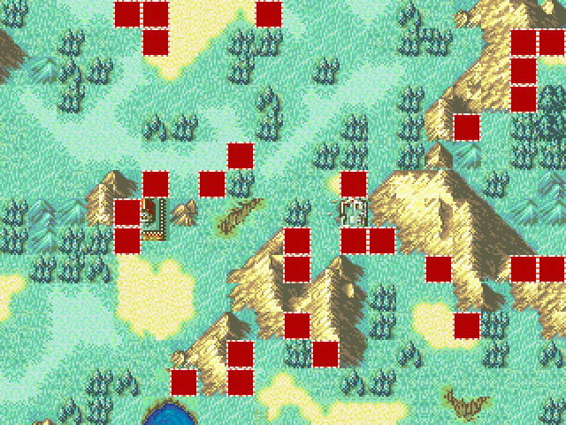
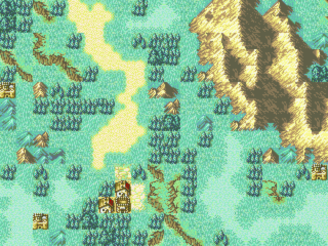
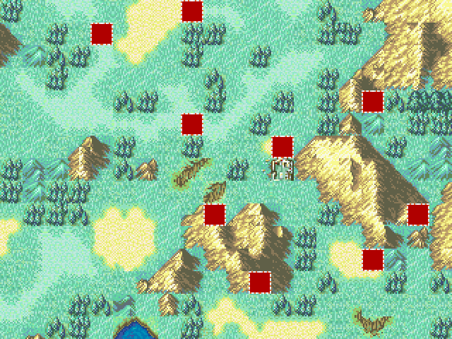

# Solver Benchmark and Promotion Gates

**Date:** 2026-07-16

**Build:** Release, .NET 10, Windows x64

**Harness:** `scripts\benchmark-solvers.ps1`

The benchmark compares `legacy`, `experimental`, and `hybrid` generation/repair through
the published CLI surface. Every produced map is checked by `validate` against learned
adjacency and applicable terrain constraints. Repeated runs with identical inputs are
SHA-256 compared.

The default-off `--experimental-branch-arc-consistency` optimization was added after
this recorded matrix. These baseline results therefore represent the flag-off path.

## Reproduce

Focused matrix used for this report:

```powershell
.\scripts\benchmark-solvers.ps1 `
  -Quick `
  -RepeatCount 2 `
  -OutputDirectory "$env:TEMP\FEMapCreator-solver-benchmark"
```

Full matrix (adds seed `99`):

```powershell
.\scripts\benchmark-solvers.ps1 `
  -RepeatCount 2 `
  -OutputDirectory "$env:TEMP\FEMapCreator-solver-benchmark-full"
```

The harness writes `results.json`, `results.csv`, generated maps/specs, preview PNGs, and
`summary.md` under the selected output directory. It exits nonzero for a validation
failure, nondeterministic output, unresolved-count regression, hybrid result worse than
legacy, or visual-diversity regression/collapse.

## Matrix

- Games: FE6, FE7, FE8.
- Families: Fields and Castle (six bundled tilesets).
- Seeds: `7` and `42`.
- Repeats: 2 per exact case.
- Algorithms: legacy, whole-map experimental, hybrid.
- Generation:
  - blank 4x3 and 20x15 maps;
  - 20x15 maps with required tag-1 cells on the left and forbidden tag-1 cells on the right;
  - 20x15 template maps split by a locked vertical wall.
- Repair:
  - one interior hole, radius 1;
  - three interior holes, radius 2.
- Experimental limits: 10,000 total search nodes, four deterministic restarts, 4,096
  retained exact nogoods.
- Timings include CLI process startup.

## Diversity metrics

Complete maps include tile `0` in diversity metrics because it is then a legitimate
resolved tile. In incomplete maps, serialized tile `0` is excluded because map files
cannot distinguish a legitimate tile-zero cell from an unresolved sentinel:

- **Entropy (bits):** Shannon entropy of 16x16 pixel-identity groups; higher means a
  broader, less predictable visual distribution.
- **Dominant share:** fraction occupied by the most common visual tile; lower is better.
- **Neighbor repeat:** fraction of scoped horizontal/vertical neighbors with identical
  tile pixels; lower means less visible tiling and clustering.

The harness hashes each 16x16 tileset image region before calculating these metrics, so
different tile IDs with identical pixels count as one visual tile.

For maps with at least 100 cells, a complete candidate fails the absolute visual gate if
dominant share exceeds 40%, entropy falls below 3 bits, or neighbor repeat exceeds 45%.
When candidate and legacy unresolved counts differ by at most five, the harness also
rejects a candidate whose dominant share/repetition is over ten percentage points worse,
or whose entropy is over 0.5 bits lower.

Repair metrics use a common mask covering the requested repair radius plus the maximum
hybrid halo, so every tile any compared algorithm may change contributes to the visual
quality gate.

## Results

| Scenario | Algorithm | Runs | Complete | Median ms | Worst ms | Median unresolved | Worst unresolved | Median entropy | Worst dominant | Worst repeat | Budget cuts | Invalid |
|---|---:|---:|---:|---:|---:|---:|---:|---:|---:|---:|---:|---:|
| blank | experimental | 48 | 48 | 605.5 | 1424 | 0 | 0 | 4.62 | 0.250 | 0.118 | 0 | 0 |
| blank | hybrid | 48 | 28 | 572.5 | 1750 | 0 | 30 | 4.09 | 0.333 | 0.235 | 20 | 0 |
| blank | legacy | 48 | 6 | 297.5 | 960 | 10.5 | 46 | 4.02 | 0.500 | 0.261 | 0 | 0 |
| disconnected | experimental | 24 | 24 | 1092 | 1457 | 0 | 0 | 6.34 | 0.073 | 0.080 | 0 | 0 |
| disconnected | hybrid | 24 | 0 | 896.5 | 2768 | 10.5 | 25 | 5.82 | 0.203 | 0.215 | 24 | 0 |
| disconnected | legacy | 24 | 0 | 414 | 923 | 24.5 | 42 | 5.82 | 0.207 | 0.254 | 0 | 0 |
| repair-multi | experimental | 24 | 24 | 341.5 | 518 | 0 | 0 | 5.05 | 0.154 | 0.228 | 0 | 0 |
| repair-multi | hybrid | 24 | 24 | 386 | 548 | 0 | 0 | 4.91 | 0.192 | 0.250 | 0 | 0 |
| repair-multi | legacy | 24 | 8 | 258.5 | 333 | 1 | 6 | 4.92 | 0.192 | 0.250 | 0 | 0 |
| repair-single | experimental | 24 | 24 | 325 | 353 | 0 | 0 | 4.39 | 0.244 | 0.220 | 0 | 0 |
| repair-single | hybrid | 24 | 24 | 263.5 | 282 | 0 | 0 | 4.31 | 0.244 | 0.250 | 0 | 0 |
| repair-single | legacy | 24 | 24 | 254.5 | 272 | 0 | 0 | 4.31 | 0.244 | 0.250 | 0 | 0 |
| terrain | experimental | 24 | 20 | 1055 | 8693 | 0 | 66 | 6.20 | 0.575 | 0.734 | 4 | 0 |
| terrain | hybrid | 24 | 4 | 906.5 | 1478 | 23 | 56 | 6.03 | 0.280 | 0.432 | 20 | 0 |
| terrain | legacy | 24 | 0 | 432 | 836 | 44 | 297 | 5.39 | 0.333 | 0.447 | 0 | 0 |

## Correctness gates

- Validation failures: **0**.
- Determinism failures: **0**.
- Hybrid-worse-than-legacy paired cases: **0**.
- Experimental-worse-than-legacy unresolved pairs: **2**, both FE6 Castle terrain
  seed-7 repeats.
- Diversity regressions/collapses: **2**, both FE6 Castle terrain seed-7 repeats.
- Experimental budget cuts: **4**, all in the constrained-terrain scenario.
- Hybrid retains its promised quality floor but often exhausts the regional budget.

The diversity-aware ordering removes the reported plain-tile collapse from blank maps.
The two former worst examples (FE6 Castle and FE8 Fields, 20x15 seed 42) now use 85 and
165 visual tiles, with dominant shares of 5.7% and 3.7% and entropy of 5.83 and 7.03
bits. The whole-map solver still has a constrained-terrain weakness: FE6 Castle seed 7
is both slightly less complete and materially less diverse than legacy, and the gate
correctly rejects it. Region-scoped repair metrics show no remaining repair diversity
regressions after evaluating the full potential hybrid repair halo.

## Human-review previews

The previews use FE8 Fields, blank 20x15, seed 42, rendered at 2x nearest-neighbor scale.
Red checkerboard tiles in legacy/hybrid are serialized unresolved tile-zero cells.

### Legacy



### Whole-map experimental



### Hybrid



## Conclusion

The whole-map experimental solver is now visually diverse on blank and disconnected
maps as well as complete in every such benchmark case. It is the strongest choice for
those scenarios and becomes the default in v1.3.0 after human review. Hybrid remains a
safe unresolved-count fallback, but its divided budget leaves more large and constrained
maps incomplete.

The promotion is an explicit product decision rather than a claim that every automated
gate passed. Experimental still fails unresolved-count, local/terrain diversity,
runtime, and budget gates in constrained cases. Legacy remains available through
`--algorithm legacy` and the WinForms menu as the rollback/compatibility mode.

## Default acceptance and rollback criteria

The following remain the target acceptance gates for retaining the experimental default:

1. Three consecutive **full** matrix runs on documented hardware.
2. Zero validation and determinism failures.
3. Zero candidate-algorithm cases worse than legacy in unresolved count.
4. Candidate median unresolved count no worse than legacy in every scenario.
5. Candidate worst runtime no more than 2x legacy in every scenario.
6. Zero entropy, dominant-share, or spatial-repetition regressions/collapses.
7. No search-budget exhaustion for the candidate default.
8. Release build and full automated tests remain green.

This report is one focused matrix, not three consecutive full matrices. The whole-map
experimental solver exceeds the 2x worst-runtime gate and exhausts its budget in some
terrain cases. Continue publishing these metrics; regressions in correctness,
determinism, blank-map diversity, or cancellation should trigger a rollback to legacy.

## Limitations

- Only two seeds were included in the committed report; the full harness adds a third.
- Process-startup noise is included, so sub-second differences should not be overread.
- Terrain uses a positive tag-1 left half and a negative tag-1 right half, exercising
  both required and forbidden terrain filtering.
- Template coverage uses one locked-wall topology.
- Repair uses center-biased nonzero source cells and two damage patterns.
- `validate` skips serialized tile `0` because map formats cannot distinguish a
  legitimate tile-zero cell from an unresolved/hole sentinel; complete-map diversity
  metrics still include it.
