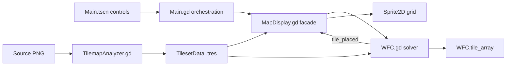
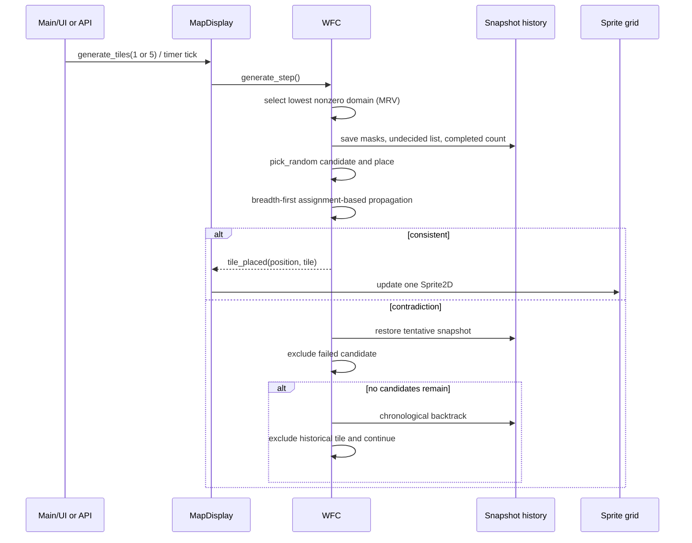

# Map Generation Methodology in `Sunnigen/godot-wfc`

## 1. Scope and Baseline

This report analyzes the map-generation methodology implemented by [`Sunnigen/godot-wfc`](https://github.com/Sunnigen/godot-wfc) at pinned `main` commit `229339cfea4e6061d493d0e9cd80fc351bf57e74`. The target is a Godot 4.3 runtime application: `Main.gd` and `Main.tscn` initiate generation, `MapDisplay.gd` acts as the UI/rendering facade, `WFC.gd` contains the solver, `TilesetData.gd` defines resource data, and `TilemapAnalyzer.gd` learns that data from PNG images. The project is not implemented as a Godot `EditorPlugin`.[^1]

The assessment emphasizes methodology before defects. “Direct code fact” denotes behavior directly represented in the pinned source; “strong static inference” denotes a consequence that follows from those representations but was not confirmed by executing the application. Runtime execution was unavailable, so no claim below should be read as an executed reproduction, benchmark, or dynamic trace.[^2]

## 2. Executive Summary

The project implements a **simple-tiled cardinal constraint model**, not the overlapping-pattern model commonly associated with canonical Wave Function Collapse (WFC). It maintains per-cell tile domains, observes a minimum-remaining-values cell, samples a candidate uniformly, propagates constraints from already placed cardinal neighbors, and handles failure through tentative-placement rollback plus chronological snapshot backtracking.[^3] Its data analyzer extracts unique tiles from PNGs, learns observed or edge-matched N/E/S/W adjacency, inserts reverse relations, and serializes Godot `.tres` resources.[^4] The central conclusion is that this is a **simple-tiled, MRV-guided, uniform-choice, assignment-propagation CSP with tentative placement and chronological snapshot backtracking**: it borrows WFC vocabulary and domain structures, but departs from canonical weighted entropy and unresolved-wave fixed-point propagation.[^5]

## 3. Key Repositories Summary

| Repository | Pinned revision | Role in this assessment | Methodological significance |
|---|---:|---|---|
| [`Sunnigen/godot-wfc`](https://github.com/Sunnigen/godot-wfc) | `229339cfea4e6061d493d0e9cd80fc351bf57e74` | Primary target | Godot 4.3 simple-tiled solver, UI facade, rendering, resource schema, and PNG analyzer.[^1] |
| [`Sunnigen/kivy-wfc`](https://github.com/Sunnigen/kivy-wfc) | `cc8c9c23db100f27acc3c3247aa2993f596a818d` | Exact predecessor, with very high confidence | Earlier Python/Kivy implementation supplying the flowers pickle lineage, candidate-count “entropy,” uniform choice, and radius-based possibility propagation.[^6] |
| [`mxgmn/WaveFunctionCollapse`](https://github.com/mxgmn/WaveFunctionCollapse) | `de7d22e705e816b62b4d613199d0463820fcaef3` | Canonical comparator | Defines overlapping and simple-tiled reference models, weighted Shannon entropy, support-count propagation, weighted observation, and retry-oriented failure handling.[^7] |

## 4. Architecture Overview

The runtime entry point is the main Godot scene. `Main` creates or rebuilds a `MapDisplay`, connects controls, loads a `TilesetData` resource, and delegates stepping or continuous generation. `MapDisplay` owns the presentation-facing lifecycle: it constructs the solver, forwards generation calls, receives tile-placement signals, and updates one `Sprite2D` when a placement succeeds. Solver state itself remains in `WFC.tile_array`, rather than in a Godot `TileMap`; no map export route was identified in the supplied static evidence.[^8]

`TilesetData` is the contract between analysis and generation. It contains tile textures, directional match rules, and probability-related fields. `TilemapAnalyzer` builds this resource from an image and saves extracted tile PNGs separately. The UI contains probability and match dialogs, but probability lookup exposed to generation returns `1.0` for each possibility, and the core selection path uses uniform random choice rather than the stored base values.[^9]



This separation is practical rather than plugin-oriented: analysis is invoked by runtime UI, generation is controlled from runtime buttons, key handlers, or a timer, and rendering reacts to solver signals. The Godot project configuration and scene wiring support this application structure without registering an editor extension.[^10]

## 5. End-to-End Generation Flow

The normal interactive path begins by loading a `.tres` resource. `Main` reconstructs the display and solver around the selected tileset. The default display size is 14×14. Buttons and keyboard shortcuts request either one or five generation steps; a checkbox/Space-controlled timer invokes one step every 10 ms. A synchronous API also exists in `WFC.generate_map(max_steps=-1)`, which repeatedly calls `generate_step()` until completion, failure, or a step cap.[^11]

At initialization, every map cell receives the full set of nonblank tile possibilities. The solver represents that state in duplicate forms: dictionaries useful to surrounding logic and packed signed-64-bit masks useful for domain operations. It caches domain cardinality under entropy terminology, marks cache entries dirty when state changes, shuffles the undecided-position array once, and relies on that shuffled order for deterministic-within-run tie traversal.[^12]

Each step observes the first undecided cell having the smallest nonzero possibility count. It tentatively tries a uniformly selected candidate, saves a snapshot, places the tile, and propagates. If propagation creates an empty domain, the attempt is rolled back and that candidate is removed for the current placement context. If all candidates at the cell fail, the solver walks historical snapshots backward, rejects the historical choice, and resumes; a 5000-operation backtracking cap bounds this process.[^13]



The important data-flow distinction is that visualization follows successful placement signals, whereas rollback is internal. There is no corresponding retraction signal in the supplied source evidence. Consequently, solver state is authoritative, while the sprite grid can become stale after backtracking or terminal failure; this is a strong static inference, not an executed observation.[^14]

## 6. Core Generation Methodology

### 6.1 State Model

Tile ID `0` is reserved as blank/undecided and is excluded from usable generation domains. Usable tile IDs are expected to be dense from `1` through `T`. The generated map lives in `tile_array`; parallel state tracks cell possibilities, bit masks, entropy counts and dirty flags, the undecided-position order, completed count, propagation work, and snapshot history. This is a finite-domain constraint-satisfaction representation with WFC-style terminology.[^15]

The mask maps tile `k` to bit `k - 1` in one `PackedInt64Array` value. That representation is compact for sufficiently small tilesets, but it is materially important to the risk analysis because a single signed 64-bit word is also used by the popcount loop and candidate operations.[^16]

### 6.2 Initialization

Initialization constructs all-tile possibility dictionaries and masks for every cell, producing roughly `O(NT)` dictionary work for `N` cells and `T` usable tiles. It does not initially filter boundary-only rules against a cell’s location. Thus an interior cell may initially include a tile whose empty directional adjacency semantically requires a map edge; such choices are deferred until placement and neighbor-based checking.[^17]

The undecided list is shuffled once. Observation later scans that list and accepts the first cell with the smallest nonzero domain size, so the initial shuffle supplies tie-breaking noise without recomputing random perturbations for every observation.[^18]

### 6.3 Observation

The solver calls domain cardinality “entropy,” but it does not calculate Shannon entropy. Its observation heuristic is conventional MRV: scan undecided cells, ignore collapsed or zero-count cells as appropriate, and select the first position having the lowest positive number of candidates. This favors the most constrained currently viable cell and can reduce branching, but it does not account for probability weights or support distribution.[^19]

```text
function observe(undecided):
    best_position = none
    best_count = infinity
    for position in shuffled_undecided_order:
        count = cached_domain_cardinality(position)
        if 0 < count < best_count:
            best_position = position
            best_count = count
    return best_position
```

### 6.4 Collapse and Candidate Choice

For the observed cell, candidate selection uses `pick_random()`. Although `TilesetData` exposes `base_probabilities`, analyzer-generated usable values are uniformly `[1, 1, 1, 1]`, the UI getter reports `1.0` for each possibility, and the core collapse path does not weight the random choice by those fields. The effective methodology is therefore uniform sampling over the current domain.[^20]

Before placing a candidate, the solver snapshots all possibility masks, the undecided list, and the completed count. Placement writes the tile, updates counters and domain state, and triggers propagation. This tentative-commit pattern gives the implementation a local transaction boundary: either propagation accepts the candidate, or state is restored and the candidate is excluded in the current search context.[^21]

### 6.5 Propagation

Propagation is breadth-first over neighboring positions, but it differs fundamentally from canonical WFC propagation. For each uncollapsed position visited, the solver rebuilds a domain from all usable tiles, constrained only by **already placed neighbors** and boundary rules. It does not require each candidate to retain support in unresolved neighboring domains. It also visits each position at most once in a propagation wave, rather than iterating reductions to a fixed point.[^22]

```text
function propagate_from(placed_position):
    queue = cardinal_neighbors(placed_position)
    visited = empty_set
    while queue not empty:
        position = queue.pop_front()
        if position in visited or position is collapsed:
            continue
        visited.add(position)
        rebuilt = all_usable_tiles
        rebuilt = filter_by_map_boundaries(rebuilt, position)
        for neighbor in already_placed_cardinal_neighbors(position):
            rebuilt = filter_by_rule(rebuilt, neighbor.tile, direction)
        set_domain(position, rebuilt)
        if rebuilt is empty:
            return contradiction
        queue.push(cardinal_neighbors(position))
    return consistent
```

Methodologically, this is best described as **assignment-based forward checking** or greedy CSP propagation. It transmits consequences of assignments through recomputation, but it is neither unresolved-wave support propagation nor an AC-3/AC-4-style fixed-point algorithm. Calling it “WFC” is understandable at the product level, yet the operational distinction matters when comparing pruning strength, contradiction timing, and performance.[^23]

### 6.6 Contradiction, Rollback, and Backtracking

An empty domain is a contradiction. During tentative placement, the solver restores the pre-placement snapshot and removes the failed candidate locally. It may then try another uniformly selected candidate. This makes candidate failure recoverable without discarding the whole map.[^24]

When every candidate for the current observed cell fails, the algorithm performs chronological history backtracking. It restores earlier frames, rejects the tile selected at the corresponding historical decision, and attempts to continue from that earlier point. Backtracking is capped at 5000 operations, and there is no automatic whole-map restart loop in the Godot driver.[^25]

The normal history walk clears assignments for popped decisions, but `_restore_state` by itself does not represent every element of a logically complete snapshot. Candidate exclusions are generally preserved through pre-placement frames; however, the final exhausted candidate is not independently persisted, and rebuilding from all tiles may reintroduce exclusions under manual or reentrant scheduling. This is a qualified strong static inference about edge scheduling, not a claim that ordinary single-threaded button use necessarily triggers it.[^26]

### 6.7 Termination

`generate_map()` repeatedly invokes `generate_step()` until the map is complete, failure occurs, or `max_steps` is reached. Completion signaling is offset from the act that fills the last cell: the completion signal is emitted only on a subsequent step that notices completion. Therefore a synchronous successful `generate_map()` can finish without emitting completion, while later calls can emit it repeatedly. This conclusion follows statically from the supplied step/loop structure and was not runtime-tested.[^27]

## 7. Tileset Learning and Serialization Pipeline

The analyzer accepts a PNG whose dimensions must be divisible by one square tile size. It extracts tiles row-major. The first unique RGB signature receives ID `1`, subsequent unique signatures receive increasing IDs, alpha is ignored for uniqueness, and no rotation or reflection equivalence is applied. A visually blank source tile is consequently an ordinary usable ID rather than solver tile `0`.[^28]

The direct-observation pass inspects source neighbors in the four cardinal directions and ignores out-of-bounds ID `0`. An optional edge-matching pass compares all tile pairs by corresponding edge colors and accepts a match when the per-channel maximum RGB difference remains within a threshold. Self edge matching is skipped. Reverse adjacency is inserted so that a learned directional relation has its opposite-direction counterpart.[^29]

Serialization order is `[S, E, N, W]`, even though some extractor labels and surrounding comments use N/E/S/W language. The analyzer embeds textures, directional rules, and probability arrays in a `.tres` resource and separately saves extracted PNG files. Representative bundled resources contain 36 usable 3×3 tiles for `flowers.tres`, 39 usable 3×3 tiles for `dungeon_simple.tres`, and 70 usable 16×16 tiles for `fe_0.tres`.[^30]

```text
analyze_png(image, tile_size, edge_matching):
    assert width % tile_size == 0
    assert height % tile_size == 0
    for tile_rect in row_major_rectangles(image, tile_size):
        rgb_signature = pixels_without_alpha(tile_rect)
        tile_id = intern_unique_signature(rgb_signature)
        source_grid.append(tile_id)

    for each source_grid cell:
        record in-bounds N/E/S/W neighbors

    if edge_matching:
        for each ordered pair of distinct tiles:
            compare corresponding edge RGB channels
            add threshold-qualified adjacency

    insert reverse adjacency
    serialize directional lists as [S, E, N, W]
    save textures/rules/probabilities to .tres
```

Two pipeline caveats are directly supported. First, the blank texture is created at the default size `16` before the analyzer assigns the requested tile size, so 3×3 resources retain a 16×16 tile-0 texture. Second, cleanup of prior analyzer outputs occurs before replacement input is fully validated, making validation order operationally significant.[^31]

## 8. Boundaries, Randomness, Weighting, and Output Semantics

An empty directional adjacency list does not mean “no restriction.” During generation it means that the corresponding side must face the map boundary. This makes empty lists a boundary vocabulary, but initialization does not apply that vocabulary by position, so invalid interior boundary-only candidates remain available until later checking.[^32]

Randomness comes from Godot’s global RNG. There is no solver-local seeded RNG API in the supplied source, which limits isolated reproducibility and makes the once-shuffled undecided order plus uniform `pick_random()` calls dependent on surrounding global random state. This is a direct API fact; no claims are made about a particular generated layout.[^33]

Probability data is currently non-operative in the central decision policy. Stored base values, analyzer defaults, and UI surfaces exist, but collapse remains uniform and observation remains count-based. The `probability_array` is mutated during solving yet is not restored by rollback/backtracking. Because core decisions use masks, this need not corrupt the primary search path, but UI, duplicate, or diagnostic state can become stale after restoration.[^34]

Output is an in-memory solver array rendered through individual `Sprite2D` nodes. No export path for the generated map was found in the supplied evidence. Loading advertises or defaults toward pickle in parts of the UI, but pickle loading is unsupported in the Godot implementation; the supported generation resource is the Godot `.tres` form created or loaded by the application.[^35]

## 9. Comparison with Canonical WFC

Canonical WFC should be treated as a comparator rather than a mandatory compliance specification. The reference repository includes both an overlapping model, which learns local `N×N` patterns from an input and places compatible pattern waves, and a simple-tiled model, which uses explicit tile adjacency. The Godot project belongs to the latter family.[^36]

| Dimension | Canonical reference | Godot implementation |
|---|---|---|
| State | Boolean wave plus directional support counts for each pattern/tile possibility.[^37] | Per-cell dictionaries and one-word bit masks, tile assignments, cached cardinalities, and snapshots.[^15] |
| Observation | Weighted Shannon entropy with small random noise for tie-breaking.[^38] | Minimum positive domain cardinality; once-shuffled undecided order breaks ties.[^19] |
| Choice | Weighted random choice from learned/configured weights.[^39] | Uniform `pick_random()` over the current domain; stored base probabilities are unused by the core decision.[^20] |
| Propagation | Ban-stack propagation updates support counts until the stack is empty, reaching a fixed point.[^40] | Breadth-first rebuilding from assigned neighbors and boundaries, with each position visited at most once per wave.[^22] |
| Contradiction | Zero remaining possibilities returns failure; drivers can retry with fresh seeds.[^41] | Zero-domain contradiction triggers local rollback and chronological snapshot backtracking; no automatic whole-map restart.[^25] |
| Periodicity | Periodic input and periodic output are explicit, separate model choices.[^42] | Map edges are nonperiodic and encoded through boundary interpretation of empty directional lists.[^32] |

Canonical high-level behavior can be summarized without reproducing source:

```text
initialize_boolean_wave_and_support_counts()
while not fully_observed:
    cell = minimum_weighted_shannon_entropy_with_noise()
    choose one possibility by configured weights
    ban all other possibilities at cell
    while ban_stack not empty:
        removed = ban_stack.pop()
        decrement directional support counts
        ban newly unsupported neighbor possibilities
    if any cell has no possibilities:
        return failure
return observed_output
```

The Godot high-level behavior is instead:

```text
initialize_every_cell_with_tiles_1_through_T()
shuffle_undecided_positions_once()
while incomplete and within limits:
    cell = first_minimum_positive_domain_cardinality()
    snapshot_preplacement_state()
    candidate = uniform_random_choice(cell.domain)
    assign(candidate)
    rebuild_reachable_uncollapsed_domains_from_assignments_and_boundaries()
    if contradiction:
        restore_snapshot_and_exclude(candidate)
        if local_domain_exhausted:
            chronologically_backtrack_and_exclude_historical_choice()
return complete_or_failure
```

The shared conceptual core is still recognizable: wave-like domains, low-domain observation, adjacency constraints, propagation after collapse, and zero-domain contradiction. The decisive differences are the absence of weighted Shannon entropy, the uniform choice policy, assignment-only propagation rather than unresolved-wave support propagation, and the addition of snapshot backtracking inside the solver.[^5]

## 10. Relationship to the Python/Kivy Predecessor

`Sunnigen/kivy-wfc` is the exact predecessor with very high confidence. The repositories share an owner, the Godot project contains the exact hard-coded path `kivy-wfc-master/data/flowers.pickle`, the default flowers asset lineage matches, and the imported adjacency represents the same 36-tile dataset. The predecessor is MIT-licensed.[^43]

Its pickle writer serializes four sequential objects: tile size; tile-ID-to-raw-RGBA-byte data; tile-ID-to-four-neighbor-set data; and tile-ID-to-four-base-value data. Its direction convention is materially connected to the Godot port: the writer pipeline supports `[S,E,N,W]`, while comments, UI labels, and extractor labels are inconsistent; the Godot extractor does not reorder, and the Godot consumer operates in `[S,E,N,W]` order.[^44]

The predecessor also calls candidate count entropy and is effectively uniform in selection. Weighted calls or base-value use are commented, and its helper ultimately returns a random choice. Thus the Godot project’s non-Shannon MRV and uniform collapse are continuations rather than entirely new simplifications.[^45]

Propagation changed more substantially. The Kivy implementation propagates a probability sphere to unresolved cells within a radius and intersects possibility dictionaries. It has no backtracking or restart, and it ignores outside-map neighbors. The Godot port replaces that mechanism with queue-based recomputation from assignments, adds explicit boundary semantics, bit masks and caches, and introduces snapshot rollback/backtracking.[^46]

## 11. Complexity and Scaling Characteristics

Let `N` be the number of map cells, `T` the number of usable tiles, and `D` the maximum directional adjacency-list length. Initialization creates all-tile dictionary state for every cell, giving `O(NT)` dictionary work and corresponding domain storage before considering duplicate mask/cache representations.[^12]

Observation scans the undecided positions to find the minimum domain. In the baseline implementation this is `O(N)` per accepted step, yielding an `O(N²)` scan component over a full map. A priority queue could reduce selection overhead, but maintaining it correctly under rollback and mass dirtying would introduce its own costs; no such structure is present in the supplied design.[^19]

A domain recomputation starts from all `T` tiles and tests directional compatibility against placed neighbors. With adjacency membership work bounded in terms of list length `D`, a useful estimate is about `O(TD)` per recomputed cell, multiplied by the number of positions reached in that propagation wave. Because propagation is not support-count incremental and can revisit broad neighborhoods across successive placements, repeated rebuilding is a major scaling factor.[^22]

Every accepted placement stores snapshot data proportional to `N`, including all possibility masks and the undecided list. If history retains `O(N)` decisions, live snapshot storage can grow to `O(N²)`. Failed rollback and historical restoration also dirty all `N` entropy entries, increasing the recovery cost beyond the local contradiction site.[^21]

These are static asymptotic characteristics, not measured performance results. Actual cost depends on map dimensions, adjacency density, contradiction frequency, backtracking depth, Godot container overhead, and the degree to which propagation waves traverse the grid.[^47]

## 12. Correctness and Robustness Risks

The rankings below combine impact and likelihood inferred from pinned source. “Direct” means the implementation fact is explicit; “strong inference” means its consequence follows statically but was not executed.

| Rank | Risk | Qualification |
|---:|---|---|
| 1 — Critical | **Single signed-64-bit mask cannot safely represent the bundled 70-tile resource.** Tile `k` maps to bit `k-1`; tile 64 sets the sign bit, popcount loops while `bits > 0`, and IDs 65+ lie outside one 64-bit word. `fe_0.tres` contains 70 usable tiles. | Direct representation and resource-size facts; incompatibility is a strong static inference. Do **not** interpret this as an executed reproduction.[^16] |
| 2 — High | **Propagation is weaker than canonical unresolved-domain consistency.** Domains are rebuilt from placed neighbors only, each position at most once per wave, so unsupported combinations among unresolved neighbors can persist until later assignments. | Direct algorithm fact; delayed contradictions and extra backtracking are strong static inferences.[^23] |
| 3 — High | **Rendering has no rollback/retraction signal.** `tile_placed` updates a sprite, but internal backtracking has no matching signal to clear or redraw reverted cells. | Direct signal-flow fact; stale sprites, particularly on terminal failure, are a strong static inference.[^14] |
| 4 — High | **Probability state is not restored.** `probability_array` mutates but snapshots restore masks/list/count rather than that array. | Direct state-management fact. Core search uses masks, so primary decisions can remain correct while UI/diagnostic duplicates become stale.[^34] |
| 5 — Medium | **Boundary-invalid choices remain in initial domains.** Empty directional adjacency means boundary-only, yet initialization starts every cell with all tiles. | Direct fact. Extra failed attempts and avoidable contradictions are likely, but their frequency is unverified.[^17] |
| 6 — Medium | **Snapshot restoration is not independently complete.** Normal reverse-history walking clears popped assignments, but `_restore_state` alone omits parts of full logical state; exclusions can be reintroduced in manual/reentrant edge scheduling. | Mixed direct fact and qualified strong inference; ordinary sequential use may preserve exclusions through surrounding frames.[^26] |
| 7 — Medium | **Completion signaling is delayed and repeatable.** The signal occurs on a later `generate_step`, not necessarily when the last cell is placed. | Direct control-flow fact; synchronous completion without emission and repeated later emission are strong static inferences.[^27] |
| 8 — Medium | **Public `place_tile` validation is weak.** It does not strongly validate undecided status, membership in the current domain, or tile ID before mutating state. | Direct API fact; repeated/manual misuse can corrupt counters or invariants, but no runtime reproduction is claimed.[^48] |
| 9 — Low/Medium | **Analyzer output lifecycle has ordering/size defects.** Tile 0 is created at default 16 before custom size assignment, and old output cleanup precedes replacement-input validation. | Direct analyzer facts; visible 3×3 blank-size inconsistency and destructive failure sequencing follow statically.[^31] |
| 10 — Low/Medium | **Reproducibility and validation coverage are limited.** There is no local seeded RNG API or automated algorithm test suite; internal consistency/debug helpers exist, but UI invocation is commented. | Direct project-status facts; impact depends on external test harnesses and global RNG control.[^33] |

## 13. Practical Usage and API Entry Points

The user-facing application initializes a 14×14 display and supports incremental operation. One-step and five-step controls route through `MapDisplay.generate_tiles`, while Space or the corresponding checkbox enables a 10 ms timer that repeatedly requests one step. This is useful for visualizing local decisions but should not be mistaken for a different solver mode; it schedules the same `generate_step()` logic.[^11]

A representative programmatic pattern, expressed as a short usage sketch rather than copied source, is:

```gdscript
var solver := WFC.new(tileset_data, Vector2i(14, 14))
solver.tile_placed.connect(_on_tile_placed)
var succeeded := solver.generate_map(-1) # run until completion or failure
var generated_cells = solver.tile_array
```

The synchronous method is suitable when callers do not need animated stepping. Callers should treat `tile_array` as the authoritative output and should not rely solely on the completion signal because of the subsequent-step emission semantics described earlier.[^27]

The incremental facade pattern is:

```gdscript
# One button press, key event, or timer tick
map_display.generate_tiles(1)

# A five-step control
map_display.generate_tiles(5)
```

Loading a `.tres` rebuilds the display and solver. The analyze dialog creates a resource from a PNG and then loads it. Pickle is part of the predecessor/import story and is advertised or defaulted in portions of the UI, but direct pickle loading is not supported by the current Godot resource path.[^35]

For robust integration, callers should avoid manually invoking `place_tile` unless they independently validate that the cell is undecided, the tile is within `1..T`, and the tile belongs to the current domain. They should also redraw from `tile_array` after any failure/backtracking boundary if visual fidelity matters, because the present signal contract only positively reports placements.[^48]

## 14. Development History and Intended-vs-Actual Status

The repository began with a full prototype commit on June 2, 2025 (`251ad74e0df8a90aadb6f0e1d7c3f4ef97045865`). Bitsets, entropy caching, and queue work arrived through PR #2, including commit `93cdc476506a92def16a7425aaa4f866accc2255` and merge commit `01ad35aca99d1a598abc89681c44876e2356795f`. Rendering work followed in PR #3 at `f008300fe82609dea186e0a36e9f2484004e90d8`.[^49]

Analyzer development is represented by commits `4691e5597aefb5f93a28f916c05a340cb78aaa93` and `a6ce6f53eda0b2cc50309b69771db2398ed23716`. The single 64-bit mask design appears at `d84d6626507397a2976623186237c18bb40cb216`. Boundary handling, analyzer changes, and backtracking work continued at `73f313182bea0b7ed1ceefd23b9b9d832fa423a0` and merged through PR #4 into the pinned current HEAD `229339cfea4e6061d493d0e9cd80fc351bf57e74`.[^50]

Documentation does not consistently describe the current implementation. The README and development materials variously claim or plan probability editing, still describe backtracking as future work, and list planned classes in `PROJECT_STRUCTURE.md` that do not exist in the analyzed architecture. These documents are useful evidence of intent, but pinned source should govern statements about actual behavior; no PR completion percentages are treated as verified facts.[^51]

## 15. Methodology Assessment and Conclusions

The implementation has a coherent CSP search architecture. Dense tile IDs, per-cell domains, MRV observation, tentative assignments, contradiction detection, and chronological rollback form a recognizable finite-domain solver. The analyzer also provides a practical content pipeline: image slicing, unique-tile interning, observed adjacency, optional edge matching, reverse-rule insertion, and Godot resource serialization.[^4]

Its most consequential methodological departure from canonical WFC is propagation. Canonical implementations maintain compatibility support across unresolved waves and repeatedly process bans until reaching a fixed point. This project instead reconstructs domains from concrete assignments and boundaries, visiting positions once per wave. That design is simpler to reason about locally and is complemented by snapshots, but it prunes less information before commitment and can shift work into later contradiction and backtracking.[^40]

The uniform candidate policy and cardinality-only “entropy” are likewise deliberate simplifications in effect, whether or not all surrounding probability UI was intended to become active. They preserve randomized variety but discard learned frequency weighting and Shannon-information ordering. The predecessor shows that both choices have lineage in the earlier Kivy implementation.[^45]

The final classification is explicit: **the project uses a simple-tiled, MRV-guided, uniform-choice, assignment-propagation CSP with tentative placement and chronological snapshot backtracking; it borrows WFC vocabulary and structures but departs from canonical weighted entropy and unresolved-wave fixed-point propagation.** This is not a judgment that canonical conformance is mandatory; it is the most precise description of the actual pinned methodology.[^5]

Before broader use, the highest-priority engineering issue is the one-word signed-mask limit because a bundled 70-tile resource exceeds the representable/safely counted range. After that, the strongest robustness improvements would be authoritative redraw/retraction on rollback, complete snapshot semantics, early boundary filtering, deterministic local RNG injection, and algorithm tests that cover contradiction, backtracking, signal emission, and resources above 63 tiles.[^16]

## 16. Confidence Assessment

Confidence is **high** for the architectural classification, resource pipeline, observation policy, uniform choice, snapshot mechanism, and the direct distinctions from canonical WFC because they are supported by pinned source ranges and pinned comparator code. Confidence is **very high** that `Sunnigen/kivy-wfc` is the direct predecessor because of ownership, the exact hard-coded pickle path, matching flowers data, serialization shape, and algorithmic continuity.[^43]

Confidence is **moderate to high** for the ranked consequences labeled strong static inference, including signed-mask failure modes, stale rendering after rollback, delayed/repeated completion signaling, and exclusion reintroduction under unusual scheduling. Runtime execution was unavailable; all such conclusions were derived from pinned source and static control/data-flow traces. No benchmark results, executed reproductions, or empirical failure rates are claimed.[^2]

## 17. Footnotes

[^1]: Target runtime and application entry evidence: [`project.godot` lines 9–16 and 23–45](https://github.com/Sunnigen/godot-wfc/blob/229339cfea4e6061d493d0e9cd80fc351bf57e74/project.godot#L9-L16), [`Main.gd` lines 11–55](https://github.com/Sunnigen/godot-wfc/blob/229339cfea4e6061d493d0e9cd80fc351bf57e74/Main.gd#L11-L55), and [`CLAUDE.md` lines 5–8](https://github.com/Sunnigen/godot-wfc/blob/229339cfea4e6061d493d0e9cd80fc351bf57e74/CLAUDE.md#L5-L8).
[^2]: Static/debug context: [`WFC.gd` lines 814–845](https://github.com/Sunnigen/godot-wfc/blob/229339cfea4e6061d493d0e9cd80fc351bf57e74/addons/wfc/core/WFC.gd#L814-L845) and [`WFC.gd` lines 847–917](https://github.com/Sunnigen/godot-wfc/blob/229339cfea4e6061d493d0e9cd80fc351bf57e74/addons/wfc/core/WFC.gd#L847-L917).
[^3]: Core state and step flow: [`WFC.gd` lines 13–42](https://github.com/Sunnigen/godot-wfc/blob/229339cfea4e6061d493d0e9cd80fc351bf57e74/addons/wfc/core/WFC.gd#L13-L42), [`WFC.gd` lines 119–221](https://github.com/Sunnigen/godot-wfc/blob/229339cfea4e6061d493d0e9cd80fc351bf57e74/addons/wfc/core/WFC.gd#L119-L221), and [`WFC.gd` lines 294–421](https://github.com/Sunnigen/godot-wfc/blob/229339cfea4e6061d493d0e9cd80fc351bf57e74/addons/wfc/core/WFC.gd#L294-L421).
[^4]: Analyzer pipeline: [`TilemapAnalyzer.gd` lines 28–79](https://github.com/Sunnigen/godot-wfc/blob/229339cfea4e6061d493d0e9cd80fc351bf57e74/addons/wfc/utils/TilemapAnalyzer.gd#L28-L79), [`lines 80–177`](https://github.com/Sunnigen/godot-wfc/blob/229339cfea4e6061d493d0e9cd80fc351bf57e74/addons/wfc/utils/TilemapAnalyzer.gd#L80-L177), and [`lines 179–270`](https://github.com/Sunnigen/godot-wfc/blob/229339cfea4e6061d493d0e9cd80fc351bf57e74/addons/wfc/utils/TilemapAnalyzer.gd#L179-L270).
[^5]: Godot/reference comparison basis: [`WFC.gd` lines 223–292](https://github.com/Sunnigen/godot-wfc/blob/229339cfea4e6061d493d0e9cd80fc351bf57e74/addons/wfc/core/WFC.gd#L223-L292) and canonical [`Model.cs` lines 99–180](https://github.com/mxgmn/WaveFunctionCollapse/blob/de7d22e705e816b62b4d613199d0463820fcaef3/Model.cs#L99-L180).
[^6]: Predecessor overview and runtime entry: [`kivy-wfc README.md` lines 1–25](https://github.com/Sunnigen/kivy-wfc/blob/cc8c9c23db100f27acc3c3247aa2993f596a818d/README.md#L1-L25), [`main.py` lines 1–20](https://github.com/Sunnigen/kivy-wfc/blob/cc8c9c23db100f27acc3c3247aa2993f596a818d/main.py#L1-L20), and [`main.kv` lines 1–39](https://github.com/Sunnigen/kivy-wfc/blob/cc8c9c23db100f27acc3c3247aa2993f596a818d/main.kv#L1-L39).
[^7]: Canonical model overview: [`WaveFunctionCollapse README.md` lines 18–31](https://github.com/mxgmn/WaveFunctionCollapse/blob/de7d22e705e816b62b4d613199d0463820fcaef3/README.md#L18-L31) and [`lines 50–94`](https://github.com/mxgmn/WaveFunctionCollapse/blob/de7d22e705e816b62b4d613199d0463820fcaef3/README.md#L50-L94).
[^8]: Display lifecycle and rendering: [`MapDisplay.gd` lines 57–101](https://github.com/Sunnigen/godot-wfc/blob/229339cfea4e6061d493d0e9cd80fc351bf57e74/addons/wfc/ui/MapDisplay.gd#L57-L101), [`lines 155–203`](https://github.com/Sunnigen/godot-wfc/blob/229339cfea4e6061d493d0e9cd80fc351bf57e74/addons/wfc/ui/MapDisplay.gd#L155-L203), and [`lines 278–359`](https://github.com/Sunnigen/godot-wfc/blob/229339cfea4e6061d493d0e9cd80fc351bf57e74/addons/wfc/ui/MapDisplay.gd#L278-L359).
[^9]: Resource and probability surfaces: [`TilesetData.gd` lines 17–70](https://github.com/Sunnigen/godot-wfc/blob/229339cfea4e6061d493d0e9cd80fc351bf57e74/addons/wfc/core/TilesetData.gd#L17-L70), [`ProbabilityPalette.gd` lines 22–84](https://github.com/Sunnigen/godot-wfc/blob/229339cfea4e6061d493d0e9cd80fc351bf57e74/addons/wfc/ui/ProbabilityPalette.gd#L22-L84), and [`TileProbabilityDialog.gd` lines 1–58](https://github.com/Sunnigen/godot-wfc/blob/229339cfea4e6061d493d0e9cd80fc351bf57e74/addons/wfc/ui/TileProbabilityDialog.gd#L1-L58).
[^10]: Scene and control wiring: [`Main.tscn` lines 1–97](https://github.com/Sunnigen/godot-wfc/blob/229339cfea4e6061d493d0e9cd80fc351bf57e74/Main.tscn#L1-L97), [`lines 184–281`](https://github.com/Sunnigen/godot-wfc/blob/229339cfea4e6061d493d0e9cd80fc351bf57e74/Main.tscn#L184-L281), and [`lines 310–331`](https://github.com/Sunnigen/godot-wfc/blob/229339cfea4e6061d493d0e9cd80fc351bf57e74/Main.tscn#L310-L331).
[^11]: UI generation controls and timing: [`Main.gd` lines 69–119](https://github.com/Sunnigen/godot-wfc/blob/229339cfea4e6061d493d0e9cd80fc351bf57e74/Main.gd#L69-L119), [`Main.gd` lines 122–218](https://github.com/Sunnigen/godot-wfc/blob/229339cfea4e6061d493d0e9cd80fc351bf57e74/Main.gd#L122-L218), and [`MapDisplay.gd` lines 111–134](https://github.com/Sunnigen/godot-wfc/blob/229339cfea4e6061d493d0e9cd80fc351bf57e74/addons/wfc/ui/MapDisplay.gd#L111-L134).
[^12]: Initialization, masks, cache, and shuffled positions: [`WFC.gd` lines 44–117](https://github.com/Sunnigen/godot-wfc/blob/229339cfea4e6061d493d0e9cd80fc351bf57e74/addons/wfc/core/WFC.gd#L44-L117).
[^13]: Candidate attempts and backtracking control: [`WFC.gd` lines 294–421](https://github.com/Sunnigen/godot-wfc/blob/229339cfea4e6061d493d0e9cd80fc351bf57e74/addons/wfc/core/WFC.gd#L294-L421) and [`lines 653–761`](https://github.com/Sunnigen/godot-wfc/blob/229339cfea4e6061d493d0e9cd80fc351bf57e74/addons/wfc/core/WFC.gd#L653-L761).
[^14]: Positive placement rendering path: [`MapDisplay.gd` lines 204–248](https://github.com/Sunnigen/godot-wfc/blob/229339cfea4e6061d493d0e9cd80fc351bf57e74/addons/wfc/ui/MapDisplay.gd#L204-L248) and solver signal/state flow in [`WFC.gd` lines 523–548](https://github.com/Sunnigen/godot-wfc/blob/229339cfea4e6061d493d0e9cd80fc351bf57e74/addons/wfc/core/WFC.gd#L523-L548).
[^15]: Tile/resource schema and solver state: [`TilesetData.gd` lines 1–15](https://github.com/Sunnigen/godot-wfc/blob/229339cfea4e6061d493d0e9cd80fc351bf57e74/addons/wfc/core/TilesetData.gd#L1-L15), [`WFC.gd` lines 13–42](https://github.com/Sunnigen/godot-wfc/blob/229339cfea4e6061d493d0e9cd80fc351bf57e74/addons/wfc/core/WFC.gd#L13-L42).
[^16]: Mask and bit-count implementation: [`WFC.gd` lines 44–117](https://github.com/Sunnigen/godot-wfc/blob/229339cfea4e6061d493d0e9cd80fc351bf57e74/addons/wfc/core/WFC.gd#L44-L117); bundled 70-tile evidence: [`fe_0.tres` lines 859–1077](https://github.com/Sunnigen/godot-wfc/blob/229339cfea4e6061d493d0e9cd80fc351bf57e74/data/generated_tilesets/fe_0.tres#L859-L1077).
[^17]: Domain initialization and boundary handling: [`WFC.gd` lines 44–117](https://github.com/Sunnigen/godot-wfc/blob/229339cfea4e6061d493d0e9cd80fc351bf57e74/addons/wfc/core/WFC.gd#L44-L117) and [`lines 448–525`](https://github.com/Sunnigen/godot-wfc/blob/229339cfea4e6061d493d0e9cd80fc351bf57e74/addons/wfc/core/WFC.gd#L448-L525).
[^18]: Shuffling and observation traversal: [`WFC.gd` lines 44–117](https://github.com/Sunnigen/godot-wfc/blob/229339cfea4e6061d493d0e9cd80fc351bf57e74/addons/wfc/core/WFC.gd#L44-L117) and [`lines 223–292`](https://github.com/Sunnigen/godot-wfc/blob/229339cfea4e6061d493d0e9cd80fc351bf57e74/addons/wfc/core/WFC.gd#L223-L292).
[^19]: MRV/cardinality observation: [`WFC.gd` lines 223–292](https://github.com/Sunnigen/godot-wfc/blob/229339cfea4e6061d493d0e9cd80fc351bf57e74/addons/wfc/core/WFC.gd#L223-L292).
[^20]: Uniform choice and probability fields: [`WFC.gd` lines 294–421](https://github.com/Sunnigen/godot-wfc/blob/229339cfea4e6061d493d0e9cd80fc351bf57e74/addons/wfc/core/WFC.gd#L294-L421), [`TilesetData.gd` lines 72–101](https://github.com/Sunnigen/godot-wfc/blob/229339cfea4e6061d493d0e9cd80fc351bf57e74/addons/wfc/core/TilesetData.gd#L72-L101), and [`TilemapAnalyzer.gd` lines 397–489](https://github.com/Sunnigen/godot-wfc/blob/229339cfea4e6061d493d0e9cd80fc351bf57e74/addons/wfc/utils/TilemapAnalyzer.gd#L397-L489).
[^21]: Snapshot and placement state: [`WFC.gd` lines 566–635](https://github.com/Sunnigen/godot-wfc/blob/229339cfea4e6061d493d0e9cd80fc351bf57e74/addons/wfc/core/WFC.gd#L566-L635) and [`lines 653–761`](https://github.com/Sunnigen/godot-wfc/blob/229339cfea4e6061d493d0e9cd80fc351bf57e74/addons/wfc/core/WFC.gd#L653-L761).
[^22]: Queue propagation and domain rebuilding: [`WFC.gd` lines 448–525](https://github.com/Sunnigen/godot-wfc/blob/229339cfea4e6061d493d0e9cd80fc351bf57e74/addons/wfc/core/WFC.gd#L448-L525) and [`lines 523–548`](https://github.com/Sunnigen/godot-wfc/blob/229339cfea4e6061d493d0e9cd80fc351bf57e74/addons/wfc/core/WFC.gd#L523-L548).
[^23]: Godot propagation compared with canonical support propagation: [`WFC.gd` lines 448–525](https://github.com/Sunnigen/godot-wfc/blob/229339cfea4e6061d493d0e9cd80fc351bf57e74/addons/wfc/core/WFC.gd#L448-L525) and canonical [`Model.cs` lines 135–180](https://github.com/mxgmn/WaveFunctionCollapse/blob/de7d22e705e816b62b4d613199d0463820fcaef3/Model.cs#L135-L180).
[^24]: Contradiction and failed-candidate recovery: [`WFC.gd` lines 294–421](https://github.com/Sunnigen/godot-wfc/blob/229339cfea4e6061d493d0e9cd80fc351bf57e74/addons/wfc/core/WFC.gd#L294-L421).
[^25]: Historical backtracking and cap: [`WFC.gd` lines 653–761](https://github.com/Sunnigen/godot-wfc/blob/229339cfea4e6061d493d0e9cd80fc351bf57e74/addons/wfc/core/WFC.gd#L653-L761) and [`lines 764–811`](https://github.com/Sunnigen/godot-wfc/blob/229339cfea4e6061d493d0e9cd80fc351bf57e74/addons/wfc/core/WFC.gd#L764-L811).
[^26]: Restore/history behavior: [`WFC.gd` lines 566–635](https://github.com/Sunnigen/godot-wfc/blob/229339cfea4e6061d493d0e9cd80fc351bf57e74/addons/wfc/core/WFC.gd#L566-L635) and [`lines 653–761`](https://github.com/Sunnigen/godot-wfc/blob/229339cfea4e6061d493d0e9cd80fc351bf57e74/addons/wfc/core/WFC.gd#L653-L761).
[^27]: Step and synchronous loop termination: [`WFC.gd` lines 119–221](https://github.com/Sunnigen/godot-wfc/blob/229339cfea4e6061d493d0e9cd80fc351bf57e74/addons/wfc/core/WFC.gd#L119-L221) and [`lines 764–811`](https://github.com/Sunnigen/godot-wfc/blob/229339cfea4e6061d493d0e9cd80fc351bf57e74/addons/wfc/core/WFC.gd#L764-L811).
[^28]: PNG validation, extraction, and uniqueness: [`TilemapAnalyzer.gd` lines 28–79](https://github.com/Sunnigen/godot-wfc/blob/229339cfea4e6061d493d0e9cd80fc351bf57e74/addons/wfc/utils/TilemapAnalyzer.gd#L28-L79) and [`lines 80–177`](https://github.com/Sunnigen/godot-wfc/blob/229339cfea4e6061d493d0e9cd80fc351bf57e74/addons/wfc/utils/TilemapAnalyzer.gd#L80-L177).
[^29]: Observed and edge-based adjacency: [`TilemapAnalyzer.gd` lines 179–270](https://github.com/Sunnigen/godot-wfc/blob/229339cfea4e6061d493d0e9cd80fc351bf57e74/addons/wfc/utils/TilemapAnalyzer.gd#L179-L270) and [`lines 279–372`](https://github.com/Sunnigen/godot-wfc/blob/229339cfea4e6061d493d0e9cd80fc351bf57e74/addons/wfc/utils/TilemapAnalyzer.gd#L279-L372).
[^30]: Serialization/resources: [`TilemapAnalyzer.gd` lines 397–489](https://github.com/Sunnigen/godot-wfc/blob/229339cfea4e6061d493d0e9cd80fc351bf57e74/addons/wfc/utils/TilemapAnalyzer.gd#L397-L489), [`flowers.tres` lines 443–568](https://github.com/Sunnigen/godot-wfc/blob/229339cfea4e6061d493d0e9cd80fc351bf57e74/data/generated_tilesets/flowers.tres#L443-L568), and [`dungeon_simple.tres` lines 487–612](https://github.com/Sunnigen/godot-wfc/blob/229339cfea4e6061d493d0e9cd80fc351bf57e74/data/generated_tilesets/dungeon_simple.tres#L487-L612).
[^31]: Analyzer lifecycle and blank texture construction: [`TilemapAnalyzer.gd` lines 28–79](https://github.com/Sunnigen/godot-wfc/blob/229339cfea4e6061d493d0e9cd80fc351bf57e74/addons/wfc/utils/TilemapAnalyzer.gd#L28-L79) and [`lines 397–489`](https://github.com/Sunnigen/godot-wfc/blob/229339cfea4e6061d493d0e9cd80fc351bf57e74/addons/wfc/utils/TilemapAnalyzer.gd#L397-L489).
[^32]: Boundary rule semantics: [`WFC.gd` lines 448–525](https://github.com/Sunnigen/godot-wfc/blob/229339cfea4e6061d493d0e9cd80fc351bf57e74/addons/wfc/core/WFC.gd#L448-L525) and rule schema in [`TilesetData.gd` lines 111–131](https://github.com/Sunnigen/godot-wfc/blob/229339cfea4e6061d493d0e9cd80fc351bf57e74/addons/wfc/core/TilesetData.gd#L111-L131).
[^33]: Random selection and debug/test surfaces: [`WFC.gd` lines 223–421](https://github.com/Sunnigen/godot-wfc/blob/229339cfea4e6061d493d0e9cd80fc351bf57e74/addons/wfc/core/WFC.gd#L223-L421), [`WFC.gd` lines 814–917](https://github.com/Sunnigen/godot-wfc/blob/229339cfea4e6061d493d0e9cd80fc351bf57e74/addons/wfc/core/WFC.gd#L814-L917), and [`Main.gd` lines 283–291](https://github.com/Sunnigen/godot-wfc/blob/229339cfea4e6061d493d0e9cd80fc351bf57e74/Main.gd#L283-L291).
[^34]: Probability-array handling and UI view: [`WFC.gd` lines 566–635](https://github.com/Sunnigen/godot-wfc/blob/229339cfea4e6061d493d0e9cd80fc351bf57e74/addons/wfc/core/WFC.gd#L566-L635), [`ProbabilityPalette.gd` lines 22–84](https://github.com/Sunnigen/godot-wfc/blob/229339cfea4e6061d493d0e9cd80fc351bf57e74/addons/wfc/ui/ProbabilityPalette.gd#L22-L84).
[^35]: Loading/analyzing/output facade: [`Main.gd` lines 228–252](https://github.com/Sunnigen/godot-wfc/blob/229339cfea4e6061d493d0e9cd80fc351bf57e74/Main.gd#L228-L252), [`MapDisplay.gd` lines 362–407](https://github.com/Sunnigen/godot-wfc/blob/229339cfea4e6061d493d0e9cd80fc351bf57e74/addons/wfc/ui/MapDisplay.gd#L362-L407), and [`extract_pickle_adjacency.py` lines 1–46](https://github.com/Sunnigen/godot-wfc/blob/229339cfea4e6061d493d0e9cd80fc351bf57e74/extract_pickle_adjacency.py#L1-L46).
[^36]: Canonical overlapping versus simple-tiled models: [`OverlappingModel.cs` lines 26–103](https://github.com/mxgmn/WaveFunctionCollapse/blob/de7d22e705e816b62b4d613199d0463820fcaef3/OverlappingModel.cs#L26-L103) and [`SimpleTiledModel.cs` lines 11–190](https://github.com/mxgmn/WaveFunctionCollapse/blob/de7d22e705e816b62b4d613199d0463820fcaef3/SimpleTiledModel.cs#L11-L190).
[^37]: Canonical wave/support state: [`Model.cs` lines 19–24](https://github.com/mxgmn/WaveFunctionCollapse/blob/de7d22e705e816b62b4d613199d0463820fcaef3/Model.cs#L19-L24) and [`lines 51–67`](https://github.com/mxgmn/WaveFunctionCollapse/blob/de7d22e705e816b62b4d613199d0463820fcaef3/Model.cs#L51-L67).
[^38]: Canonical observation entropy: [`Model.cs` lines 73–97](https://github.com/mxgmn/WaveFunctionCollapse/blob/de7d22e705e816b62b4d613199d0463820fcaef3/Model.cs#L73-L97) and random helper support in [`Helper.cs` lines 10–24](https://github.com/mxgmn/WaveFunctionCollapse/blob/de7d22e705e816b62b4d613199d0463820fcaef3/Helper.cs#L10-L24).
[^39]: Canonical weighted choice: [`Model.cs` lines 99–132](https://github.com/mxgmn/WaveFunctionCollapse/blob/de7d22e705e816b62b4d613199d0463820fcaef3/Model.cs#L99-L132).
[^40]: Canonical ban/support fixed-point propagation: [`Model.cs` lines 135–180](https://github.com/mxgmn/WaveFunctionCollapse/blob/de7d22e705e816b62b4d613199d0463820fcaef3/Model.cs#L135-L180) and [`lines 182–230`](https://github.com/mxgmn/WaveFunctionCollapse/blob/de7d22e705e816b62b4d613199d0463820fcaef3/Model.cs#L182-L230).
[^41]: Canonical driver retry/failure flow: [`Program.cs` lines 24–66](https://github.com/mxgmn/WaveFunctionCollapse/blob/de7d22e705e816b62b4d613199d0463820fcaef3/Program.cs#L24-L66).
[^42]: Periodic input/output concepts: [`WaveFunctionCollapse README.md` lines 50–94](https://github.com/mxgmn/WaveFunctionCollapse/blob/de7d22e705e816b62b4d613199d0463820fcaef3/README.md#L50-L94).
[^43]: Predecessor linkage and license: [`extract_pickle_adjacency.py` lines 1–46](https://github.com/Sunnigen/godot-wfc/blob/229339cfea4e6061d493d0e9cd80fc351bf57e74/extract_pickle_adjacency.py#L1-L46), predecessor [`main.py` lines 84–110](https://github.com/Sunnigen/kivy-wfc/blob/cc8c9c23db100f27acc3c3247aa2993f596a818d/main.py#L84-L110), and [`LICENSE` lines 1–21](https://github.com/Sunnigen/kivy-wfc/blob/cc8c9c23db100f27acc3c3247aa2993f596a818d/LICENSE#L1-L21).
[^44]: Pickle schema and direction pipeline: predecessor [`create_data_set.py` lines 392–425](https://github.com/Sunnigen/kivy-wfc/blob/cc8c9c23db100f27acc3c3247aa2993f596a818d/utils/create_data_set.py#L392-L425), [`lines 438–487`](https://github.com/Sunnigen/kivy-wfc/blob/cc8c9c23db100f27acc3c3247aa2993f596a818d/utils/create_data_set.py#L438-L487), and Godot [`extract_pickle_adjacency.py` lines 51–143](https://github.com/Sunnigen/godot-wfc/blob/229339cfea4e6061d493d0e9cd80fc351bf57e74/extract_pickle_adjacency.py#L51-L143).
[^45]: Predecessor entropy and selection: [`wfc.py` lines 96–165](https://github.com/Sunnigen/kivy-wfc/blob/cc8c9c23db100f27acc3c3247aa2993f596a818d/wfc.py#L96-L165), [`wfc.py` lines 168–243](https://github.com/Sunnigen/kivy-wfc/blob/cc8c9c23db100f27acc3c3247aa2993f596a818d/wfc.py#L168-L243), and [`helper_functions.py` lines 107–136](https://github.com/Sunnigen/kivy-wfc/blob/cc8c9c23db100f27acc3c3247aa2993f596a818d/utils/helper_functions.py#L107-L136).
[^46]: Predecessor propagation and lack of backtracking: [`wfc.py` lines 245–415](https://github.com/Sunnigen/kivy-wfc/blob/cc8c9c23db100f27acc3c3247aa2993f596a818d/wfc.py#L245-L415), [`wfc.py` lines 454–530](https://github.com/Sunnigen/kivy-wfc/blob/cc8c9c23db100f27acc3c3247aa2993f596a818d/wfc.py#L454-L530), and [`pathfinding.py` lines 125–155](https://github.com/Sunnigen/kivy-wfc/blob/cc8c9c23db100f27acc3c3247aa2993f596a818d/pathfinding.py#L125-L155).
[^47]: Relevant solver loops and containers for static complexity: [`WFC.gd` lines 44–117](https://github.com/Sunnigen/godot-wfc/blob/229339cfea4e6061d493d0e9cd80fc351bf57e74/addons/wfc/core/WFC.gd#L44-L117), [`lines 223–292`](https://github.com/Sunnigen/godot-wfc/blob/229339cfea4e6061d493d0e9cd80fc351bf57e74/addons/wfc/core/WFC.gd#L223-L292), and [`lines 448–525`](https://github.com/Sunnigen/godot-wfc/blob/229339cfea4e6061d493d0e9cd80fc351bf57e74/addons/wfc/core/WFC.gd#L448-L525).
[^48]: Public placement and display entry points: [`WFC.gd` lines 523–548](https://github.com/Sunnigen/godot-wfc/blob/229339cfea4e6061d493d0e9cd80fc351bf57e74/addons/wfc/core/WFC.gd#L523-L548) and [`MapDisplay.gd` lines 563–576](https://github.com/Sunnigen/godot-wfc/blob/229339cfea4e6061d493d0e9cd80fc351bf57e74/addons/wfc/ui/MapDisplay.gd#L563-L576).
[^49]: Early history: [prototype commit `251ad74`](https://github.com/Sunnigen/godot-wfc/commit/251ad74e0df8a90aadb6f0e1d7c3f4ef97045865), [bitset/cache commit `93cdc47`](https://github.com/Sunnigen/godot-wfc/commit/93cdc476506a92def16a7425aaa4f866accc2255), [merge `01ad35a`](https://github.com/Sunnigen/godot-wfc/commit/01ad35aca99d1a598abc89681c44876e2356795f), [PR #2](https://github.com/Sunnigen/godot-wfc/pull/2), and [PR #3](https://github.com/Sunnigen/godot-wfc/pull/3).
[^50]: Later history: [analyzer commit `4691e55`](https://github.com/Sunnigen/godot-wfc/commit/4691e5597aefb5f93a28f916c05a340cb78aaa93), [`a6ce6f5`](https://github.com/Sunnigen/godot-wfc/commit/a6ce6f53eda0b2cc50309b69771db2398ed23716), [64-bit mask `d84d662`](https://github.com/Sunnigen/godot-wfc/commit/d84d6626507397a2976623186237c18bb40cb216), [boundary/backtracking `73f3131`](https://github.com/Sunnigen/godot-wfc/commit/73f313182bea0b7ed1ceefd23b9b9d832fa423a0), and [PR #4](https://github.com/Sunnigen/godot-wfc/pull/4).
[^51]: Intended-versus-actual documentation: [`README.md` lines 27–37](https://github.com/Sunnigen/godot-wfc/blob/229339cfea4e6061d493d0e9cd80fc351bf57e74/README.md#L27-L37), [`README.md` lines 91–128](https://github.com/Sunnigen/godot-wfc/blob/229339cfea4e6061d493d0e9cd80fc351bf57e74/README.md#L91-L128), [`DEVELOPMENT_PLAN.md` lines 50–80](https://github.com/Sunnigen/godot-wfc/blob/229339cfea4e6061d493d0e9cd80fc351bf57e74/DEVELOPMENT_PLAN.md#L50-L80), and [`PROJECT_STRUCTURE.md` lines 20–31](https://github.com/Sunnigen/godot-wfc/blob/229339cfea4e6061d493d0e9cd80fc351bf57e74/PROJECT_STRUCTURE.md#L20-L31).
