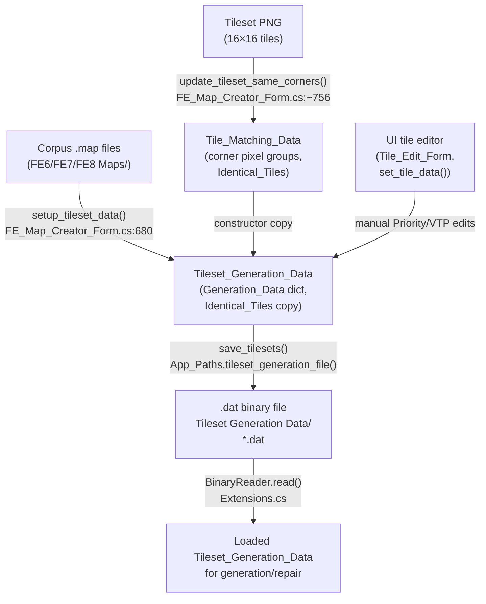
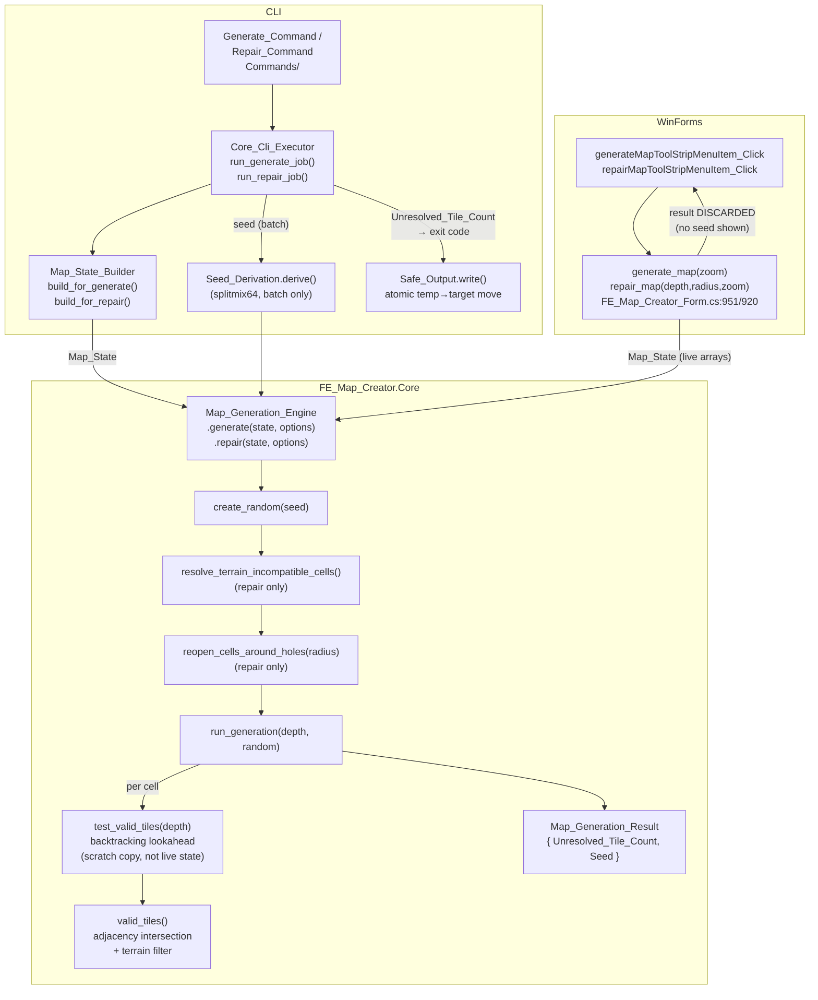

# Random Map Generation & Repair Methodology — FEMapCreator

**Repository:** [laqieer/FEMapCreator](https://github.com/laqieer/FEMapCreator)  
**Implementation snapshot:** Experimental constraint solver default with legacy and hybrid alternatives

**Date of analysis:** 2026-07-15
**Scope:** Entire corpus-training pipeline, generation algorithm, repair pipeline, CLI and WinForms interfaces, determinism guarantees, failure modes, test coverage, and design history.

---

## 2. Executive Summary

FEMapCreator has three corpus-trained modes behind the shared `Map_Generation_Engine`. The **whole-map experimental constraint solver** is the default in Core, CLI, job specs, and WinForms; it decomposes open cells into components, uses reversible word-level domains and fixed-point AC-3 propagation for propagated greedy completion, applies diversity-aware least-constraining weighted ordering, and combines deterministic best-partial and complete restarts under one global node budget. Complete restarts add conflict-directed backjumping and a bounded exact nogood cache. The default-off branch-arc-consistency option applies the same fixed-point propagation at the root and after each complete-search assignment. The **legacy frontier solver** remains explicitly selectable and preserves historical seeded behavior; **hybrid** runs legacy first and regionally improves unresolved cells. All modes operate on `Map_State` (`Tiles`, `Drawn`, `Locked`, and `Terrain`) and support generation and repair. CLI selection uses `--algorithm experimental|legacy|hybrid`; job specs use `"algorithm"`; WinForms starts with **Experimental Constraint Solver** checked. CLI and WinForms report seeds, unresolved counts, progress, restart/search diagnostics, budget exhaustion, and cooperative cancellation.

---

## 3. Key Repositories / Projects

| Assembly | Directory | Runtime | Purpose |
|---|---|---|---|
| `FE_Map_Creator.Core` | `FE_Map_Creator.Core/` | `net10.0` | Cross-platform generation/repair engine; data model; IO codecs; asset catalog |
| `FE_Map_Creator.Cli` | `FE_Map_Creator.Cli/` | `net10.0` | CLI frontend: `generate`, `repair`, `batch`, `tilesets` commands |
| `FE_Map_Creator` | `FE_Map_Creator/` | `net10.0-windows` | WinForms GUI (decompiled from bwdyeti.com binary) |
| `FE_Map_Creator.Tests` | `FE_Map_Creator.Tests/` | `net10.0` | MSTest unit + integration tests |
| `FEXNA_Library` | `FEXNA_Library/` | `net10.0` | `Data_Tileset`, `Data_Terrain` DTOs (ported from decompiled DLL) |

---

## 4. Architecture Overview

### 4.1 Training / Model-Building Data Flow



### 4.2 Generate and Repair Runtime Data Flow



---

## 5. Data Model and Training Methodology

### 5.1 Directions

The `Tile_Directions` enum[^1] uses a numeric-keypad convention: `2`=Down, `4`=Left, `6`=Right, `8`=Up; opposite of direction `d` is always `10 - d`. Corner directions `SW(1)`, `SE(3)`, `NW(7)`, `NE(9)` appear only in pixel-matching; `Center(5)` is a synthetic query meaning "all four corners identical".

### 5.2 `Tile_Data` — Per-Tile Weighted Adjacency Table

`Tile_Data`[^2] stores:

- **`Priority` (short):** intrinsic expansion weight used by the frontier picker. After pure corpus training this is **always 0**; it is non-zero only if set via the `Tile_Edit_Form` UI editor[^3].
- **`Valid_Tile_Priority[dir][neighbor_tile]` (short):** observed co-occurrence weight. Initialized to 1 on first observation, incremented by 1 on every repeat → for *n* observations the canonical-pair weight is **n + 1**[^4].

Binary layout: `Int16 Priority`, then 4 direction dictionaries (direction byte, neighbor count, then (tile, weight) pairs)[^5].

Merge constructor `Tile_Data(IEnumerable<Tile_Data>)` combines sources by:
- Priority = arithmetic mean (truncated to `short`)
- Each neighbor weight = RMS: `max(1, sqrt(mean(w²)))` across sources containing that neighbor[^6]

### 5.3 `Tile_Matching_Data` — Pixel Corner Groups

`update_tileset_same_corners()`[^7] scans every tile pair (indices 1..N-1, outer loop; inner loop always index > outer) and compares 8×8-pixel quadrant sub-rectangles at offsets:

| Corner | dx | dy | Screen region |
|---|---|---|---|
| SW (1) | 0 | 8 | bottom-left |
| SE (3) | 8 | 8 | bottom-right |
| NW (7) | 0 | 0 | top-left |
| NE (9) | 8 | 0 | top-right |

`compare_pixels` with `Modes.Normal` uses integer division (`num9 = sum_abs_channel_diffs / 4`), treating differences totalling < 4 across all RGBA channels as a pixel match — effectively exact for typical opaque 8-bit sprites[^8].

`refresh_identical()` maps all tiles sharing the same four corners to the **lowest-index member** (the canonical)[^9]. Redundant tiles (non-canonical members) are excluded from `matched_tiles()` results for cardinal directions via `.Except(redundant_tiles)`.

### 5.4 `Tileset_Generation_Data` — Full Tileset Model

`Tileset_Generation_Data`[^10] holds:
- `Identical_Tiles: Dictionary<short, short>` — every member tile → canonical tile
- `Generation_Data: Dictionary<int, Tile_Data>` — canonical tile index → adjacency table

`fix_identical(new_identical)` is called when the tileset PNG changes. It collects changed tiles, groups them by new canonical, merges their `Tile_Data` via the RMS constructor, remaps cross-group edges, and rebuilds reverse entries. A first-wins collision may silently drop data when two old tiles in the same new group both have edges to the same partner group[^11].

### 5.5 Corpus Scan — Training Pseudocode

```
FUNCTION setup_tileset_data(corpus_maps):
  gen_data ← new Tileset_Generation_Data(tile_count, Tile_Matches)
  FOR each map M:
    FOR each cell (x, y):
      A_c ← canonical(M[x,y])
      IF A_c ∉ gen_data.Generation_Data:
        gen_data.Generation_Data[A_c] ← new Tile_Data()   // Priority=0
      FOR dir ∈ {2, 4, 6, 8}:
        B_c ← canonical(neighbor(M, x, y, dir))
        IF B_c == -1 (off-map): CONTINUE
        IF B_c ∉ gen_data.Generation_Data[A_c].VTP[dir]:
          // FIRST OBSERVATION: initialize all matched-face pairs to weight 1
          group_A = Tile_Matches.matched_tiles(dir, A_c)       // excl. redundant
          group_B = Tile_Matches.matched_tiles(10-dir, B_c)    // excl. redundant
          FOR t1 IN group_A, t2 IN group_B:
            IF (t1,dir,t2) not yet in VTP: VTP[t1][dir][t2] ← 1
        // ALWAYS: increment canonical pair (starts at 2 on first encounter)
        gen_data.Generation_Data[A_c].VTP[dir][B_c] += 1
  SAVE gen_data to *.dat
```

**Weight symmetry:** The corpus processes all four directions for every cell. For a horizontal pair A↔B, processing A at direction Right adds +1 to `A_c.VTP[6][B_c]`; processing B at direction Left adds +1 to `B_c.VTP[4][A_c]`. Because both come from the same physical adjacency the counts are identical — symmetry is a corpus property, not an explicit code step[^12].

**Priority remains 0** after pure corpus training; `setup_tileset_data` creates `new Tile_Data()` entries but never writes `Priority`[^13].

---

## 6. Generation Methodology

### 6.1 State Model

`Map_State`[^14] is a thin mutable wrapper around four parallel `[Width, Height]` arrays:

| Array | Type | Semantics |
|---|---|---|
| `Tiles` | `int[,]` | Tile index; 0 = undrawn sentinel **or** legitimate tile |
| `Drawn` | `bool[,]` | Whether this cell has been committed (only authority for "resolved") |
| `Locked` | `bool[,]` | Cell never modified by the engine |
| `Terrain` | `int[,]` | +n = require tag n; −n = forbid tag n; 0 = unconstrained |

### 6.2 `run_generation` — Frontier Expansion Loop

The complete loop[^15]:

1. **Initialize:** `tile_priorities[x,y] = data[Tiles[x,y]]?.Priority ?? -1`; `open_tiles` (frontier `HashSet<int>`) = all drawn cells with ≥1 undrawn/unlocked neighbor (encoded as `x + y·Width`).

2. **Frontier-empty branch:** call `pick_fillable_cell()` (enumerates every undrawn/unlocked cell, picks uniformly) → call `try_seed_tile()` (picks a random terrain-compatible tile from `Generation_Data.Keys`) → if no valid seed anywhere, call `mark_unfillable_cells_as_unresolved()` (marks every remaining unlocked/undrawn cell `Tiles=0, Drawn=true`) and exit.

3. **Frontier-non-empty branch:** `pick_first_open_tile()` — two linear passes over `open_tiles` to find the maximum `Priority` then collect and randomly break ties[^16]. If the selected cell is stale (no open neighbors), skip. Otherwise pick a random open direction `dir`, identify `target` cell.

4. **Candidate admissibility:** `test_valid_tiles(target, depth)` returns candidates via adjacency key-set intersection — see §7.

5. **Weighted selection:** each candidate is added to a bag `weight` times (weight = `valid_tile_priority(source_tile, dir, candidate)`, default 1 if source not in config)[^17]. A single `Random.Next` draw selects from the bag. **Unseen adjacency pairs are excluded before weight lookup; the default weight 1 applies only when the source tile is a non-canonical duplicate whose raw index misses the config lookup**[^18].

6. **Identical-tile group expansion:** if `chosen` maps to a canonical via `identical_tiles`, collect all tiles mapping to that canonical and pick uniformly among them[^19].

7. **Commit:** `draw_tile()` sets `Drawn=true`, `Tiles=index`, fires `Tile_Drawn_Callback`, adds to frontier if the new cell has open neighbors. Update `tile_priorities` from source tile's priority. Remove source from frontier if it has no more open directions.

### 6.3 Disconnected-Component Handling

When the frontier drains but unfilled cells remain (e.g., behind a locked wall), a fresh seed is placed in an arbitrary fillable cell and expansion continues[^20]. The original WinForms `generate_map()` placed only one initial seed and gave up on the whole frontier after it drained — silently leaving disconnected regions empty.

### 6.4 Unresolved Handling

If `test_valid_tiles` returns `{}` or `{0}` (the no-neighbor sentinel), `unresolved++; chosen = 0`[^21]. The result `Map_Generation_Result.Unresolved_Tile_Count` accumulates these counts.

---

## 7. Lookahead / Backtracking

### 7.1 `test_valid_tiles` — Bounded Backtracking Search

`test_valid_tiles(state, base_x, base_y, depth)`[^22]:

1. Allocates **scratch copies** of `Tiles` and `Drawn` (full map clone). All lookahead reads/writes use scratch — never live state[^23].

2. Builds `locs`: cells in Manhattan rings 0..`depth` from `(base_x, base_y)` that are either undrawn or (`Drawn=true AND Tile=0 AND Terrain≠0 AND terrain_tileset≠null`).

| Depth | Rings | Max `locs` size |
|---|---|---|
| 1 | 0, 1 | 1 + up to 4 = **5** |
| 2 | 0, 1, 2 | 1 + up to 4 + up to 8 = **13** |

3. **Early exit:** if `valid_tiles(locs[0])` returns `{}`, or `locs` has only one entry, or the result is the singleton `{0}`, returns immediately.

4. **Iterative backtracking** (cursor-based, no recursion)[^24]: cursor starts at 0 (the target cell). Each step:
   - If `valid_surrounding_tiles(cursor)` succeeds (every `locs[cursor+1..]` cell has ≥1 valid tile given current scratch assignments): advance cursor or, if at `|locs|-2`, accept → reset inner cells, advance `candidate_index[0]`.
   - Else: advance `candidate_index[cursor]`; if exhausted, backtrack (`cursor--`). When cursor=0 and its candidate list is exhausted, `tiles[0]` may be empty.

5. Returns `tiles[0]` — the list of target-cell candidates that proved forward-feasible.

### 7.2 What the Search Proves

The algorithm establishes **forward sequential feasibility**: for each surviving `locs[0]` candidate there exists *at least one* ordered assignment of `locs[1..N-2]` such that every cell from `locs[1]` to `locs[N-1]` has a non-empty candidate set at each step in the enumeration order. This is **not AC-3 arc consistency**, **not full local consistency**, and **not mutual consistency** among ring-level cells[^25]. A depth-2 candidate may still dead-end ring-3 cells.

### 7.3 Complexity

- Per target cell: O(N) to clone scratch arrays + O(L · C^L) worst-case backtracking, where N = map cells, L = `|locs|` (≤5 or ≤13), C = max candidate count. Full pass over N cells: **O(N² + N · L · C^L)**[^26].
- Weighted bag: O(C · W_max) per selection, where W_max ≤ 32,767 (`short` maximum)[^27].
- Scratch clone dominates at map scale: O(N) allocations of O(N) arrays per generation = O(N²) total allocation work.

### 7.4 Experimental Global Constraint Solver

The experimental path is selected by default through
`Map_Generation_Algorithm.Experimental_Constraint`; legacy remains explicitly available.
`Experimental_Tile_Model` canonicalizes identical tiles, retains terrain-compatible
actual aliases, validates positive bidirectional adjacency edges, and precomputes compact
neighbor bitsets.

`Experimental_Map_Generation_Solver` partitions open cells into cardinal connected
components and solves easier/lower-domain components first. Each component receives the
entire remaining global node budget, so unused work carries forward. Propagated greedy
completion establishes initial and assignment-triggered fixed-point AC-3 consistency
through cached neighbor bitsets; every domain change is reversible through a word-level
trail. Complete backtracking retains its historical immediate
assigned-neighbor checks unless `Experimental_Enable_Branch_Arc_Consistency` is true
(`--experimental-branch-arc-consistency`,
`experimentalEnableBranchArcConsistency`). When enabled, each recursive entry consumes
one search node before root/branch propagation, while arc revisions remain internal
work. The search then chooses a minimum-domain cell from the propagated domains and
retains deterministic weighted candidate ordering. A propagation wipeout conservatively
attributes conflict to every current assignment before nogood learning/backjumping.
Support is a soft factor rather than an absolute ordering; global usage and radius-two
local repetition penalties prevent highly compatible plain tiles from collapsing the
map.

Unresolved is an explicit assignment state, not tile index `0`. The first restart
performs a short best-partial search; complete restarts use conflict-directed
backjumping and share a FIFO-bounded cache of exact failed partial assignments; a final
partial restart consumes remaining budget when configured. A zero-unresolved result
terminates later restarts and is globally optimal. `Map_Generation_Result` exposes
per-component node limits/counts, restart/best-restart data, propagation removals,
learned/reused nogoods, backjumps, and budget exhaustion. Search runs on cloned arrays,
only the final assignment is copied to the caller, and cancellation commits nothing.
The worst case remains exponential, so search stays node-bounded and branch arc
consistency remains default-off.

### 7.5 Experimental Hybrid Solver

`Map_Generation_Algorithm.Experimental_Hybrid` first runs the unchanged legacy solver on
a working copy and records its exact unresolved coordinates. Original failures whose
maximum halos can touch are grouped into deterministic regions. Each region starts at
`Hybrid_Initial_Halo`; only that region is reopened and passed to the experimental
component solver. A strictly better regional result is retained, completed regions stop
expanding, and only still-unresolved regions advance toward `Hybrid_Max_Halo`.

All regional attempts share one search-node budget. The final state falls back to the
legacy state for every region that was not improved, so hybrid unresolved count can
never exceed legacy. Cells outside each accepted region's final halo remain equal to the
legacy result. Diagnostics include the legacy unresolved count, accepted maximum halo,
per-region/per-halo attempts, all attempted components, and total search work. Hybrid is
selected explicitly through Core, `--algorithm hybrid`, job specs, or the unchecked
WinForms hybrid menu item; it does not change the experimental default.

---

## 8. Repair Methodology

### 8.1 Three Phases

`repair(state, options)`[^28] runs three sequential phases on the same `Map_State`:

**Phase 1 — `resolve_terrain_incompatible_cells()`**[^29]: For every cell with `Terrain[x,y] ≠ 0` (and `_terrain_tileset ≠ null`), check the drawn tile's terrain tag. If incompatible (`tag ≠ terrain` for positive constraint; `tag == -terrain` for negative), set `Tiles[x,y] = 0`. **There is no `Locked` guard in this loop.** A locked cell whose tile is terrain-incompatible has its tile value overwritten to 0; `Drawn` and `Locked` remain true.

**Phase 2 — `reopen_cells_around_holes(radius)`**[^30]: Snapshot all `Tiles[x,y] == 0` cells as holes (two-pass design prevents cascade). For each hole, iterate the Manhattan diamond of radius `radius`; for every cell in the diamond that is `Drawn AND NOT Locked`: set `Tiles=0, Drawn=false`. This is the reopening step.

**Phase 3 — `run_generation(depth, random)`**: Identical algorithm as `generate()`. Cells with `Drawn=false` are open for fill; existing drawn cells form the initial frontier.

### 8.2 Radius Diamond

Radius 0: only holes themselves are reopened (radius=0 loop visits `dx=dy=0`, which is the hole itself — already tile 0, Drawn=true; the second guard `!Locked` may flip it to Drawn=false). Radius R reopens a Manhattan diamond of 2R²+2R+1 cells around each hole.

### 8.3 Locked/Drawn Cell States After Repair

| Cell state entering repair | Phase 1 | Phase 2 | Phase 3 | Final state |
|---|---|---|---|---|
| Locked, terrain OK | Unchanged | Preserved (lock check) | Never redrawn | Unchanged |
| **Locked, terrain INCOMPATIBLE** ⚠️ | **Tiles→0** (no lock guard) | Included as hole; neighbors may be reopened; cell itself preserved by lock check | Never redrawn | **Tiles=0, Drawn=true, Locked=true — permanent hole** |
| Unlocked, drawn, terrain OK, outside radius | Unchanged | Unchanged | In frontier if has open neighbors | Unchanged |
| Unlocked, drawn, terrain OK, inside radius | Unchanged | Tiles→0, Drawn→false | Eligible for fill | Regenerated |
| Unlocked, drawn, terrain incompatible | Tiles→0 | Drawn→false | Eligible for fill | Regenerated |

### 8.4 WinForms Repair Pre-Pass

`repairMapToolStripMenuItem_Click`[^31] also scans terrain-incompatible cells on the UI thread before starting the repair thread. This pre-pass mutates `Map_Tiles[]` before the `Updating` guard — meaning if `Updating` is already true and the guard bails, the terrain pre-clearing already happened without an undo snapshot. The Core engine's phase 1 then re-scans and is a no-op (tiles are already 0), so the net result is identical; but the state mutation before the `Updating` guard is a correctness risk if the guard fires mid-scan.

### 8.5 Comparison with Generation

Repair and generation use the **same** `run_generation` loop. The only differences are the pre-passes (phases 1 and 2) and the initial cell state: for repair most cells start `Drawn=true` and only the reopened region is open; for generation most cells start `Drawn=false`.

---

## 9. Determinism, Interfaces, and Operational Behavior

### 9.1 Seed Handling

`create_random(int? seed)`[^32] uses `System.Random` (xoshiro256** since .NET 6):
- Explicit seed → deterministic; same seed + same input + same version → identical output.
- Null seed → `new Random().Next()` (time-seeded), result reported back in `Map_Generation_Result.Seed`.

**Same-version reproducibility only:** `System.Random` is deterministic within a .NET major version. The project targets `net10.0`; output is not guaranteed identical across .NET major versions[^33].

### 9.2 Batch Seed Derivation

`Seed_Derivation.derive(base_seed, job_index)`[^34] (1-based `job_index`):

```csharp
ulong x = unchecked((ulong)(uint)base_seed * 0x9E3779B97F4A7C15UL + (ulong)(uint)job_index);
x ^= x >> 30; x *= 0xBF58476D1CE4E5B9UL;
x ^= x >> 27; x *= 0x94D049BB133111EBUL;
x ^= x >> 31;
return unchecked((int)(uint)x);
```

The public-domain splitmix64 finalizer. The `(uint)base_seed` cast means negative seeds are treated as large unsigned values; `derive(-1, n)` is not symmetric with `derive(1, n)`. For unseeded `--count` batches a single time-seeded `shared_random` generates all per-job seeds sequentially to avoid the "many `new Random()` in a tight loop" correlated-seed pitfall[^35].

### 9.3 CLI vs. WinForms Differences

| Aspect | CLI | WinForms |
|---|---|---|
| Seed reported | Always (stdout summary line) | Status bar; warning for incomplete results |
| Unresolved count | Always (stdout + exit code) | Warning dialog when nonzero |
| Cancellation | `CancellationToken` (Ctrl+C) | Cancel button backed by `CancellationTokenSource` |
| Threading | `Task.Run` (thread pool) | `new Thread(...).Start()` (foreground) |
| Algorithm | `--algorithm experimental\|legacy\|hybrid` (experimental default) | Experimental checked by default; hybrid/legacy selectable |
| Depth control | `--depth 1\|2` (default 1) | `DepthUpDown`; legacy generation retains depth 1 |
| Seed control | `--seed N` or auto | No UI for seed |
| Output safety | Atomic temp→target move | Direct write, no overwrite protection |

### 9.4 Output and Exit Code Policy (CLI)

| Exit code | Meaning |
|---|---|
| 0 | Success (or `--allow-incomplete`) |
| 1 | Error (bad args, missing files, invalid data) |
| 2 | Incomplete result (unresolved cells; or `--require-complete` with holes) |
| 3 | Batch partially failed |

`--require-complete` suppresses file output on unresolved; `--allow-incomplete` exits 0 even with unresolved cells[^36].

---

## 10. Failure Modes and Correctness Risks

### 10.1 Legacy Tile-0 Ambiguity

Legacy generation still uses drawn tile `0` as its unresolved representation, while tile
`0` is also a legitimate tile. Experimental search keeps unresolved as `Drawn=false`
internally and only uses tile `0` when serializing an unresolved cell through map formats
that do not persist drawn state.

### 10.2 Imported Repair-Hole Ambiguity

Text, MAR, and TMX map formats do not store `Drawn`, so repair continues treating imported
tile `0` as a hole for compatibility. A legitimate persisted tile-0 cell cannot be
distinguished from a hole without a sidecar drawn mask.

### 10.3 Legacy Greedy Dead Ends

The legacy solver still commits a local choice permanently and marks a later
contradiction unresolved. This behavior is retained for compatibility and stable seeded
output. The experimental solver exists specifically to backtrack across those choices.

### 10.4 Experimental Worst-Case Runtime

The experimental branch-and-bound search has exponential worst-case behavior,
particularly when proving the minimum unresolved count for a contradictory map. It
checks cancellation throughout the search and exposes explicit node/restart limits.

### 10.5 Different Seeded Layouts by Algorithm

Legacy and experimental modes consume the RNG in different decision orders, so the same
seed is deterministic within each algorithm but does not imply identical maps across
algorithms.

### 10.6 Short Weight Overflow

`Tile_Data.Valid_Tile_Priority` stores weights as `short`. The training increment[^44] `(short)((int)w + 1)` wraps to a negative value at 32,767 observations. A negative weight causes `for (int i = 0; i < weight; ++i) weighted.Add(candidate)` to add zero candidates; the weighted bag may become empty or malformed. No overflow guard or saturation exists.

### 10.7 `fix_identical` First-Wins Collision

`fix_identical()` remaps neighbor edges using `source.First(...)` when two old tiles within the same new group both have edges pointing to the same merged-group partner[^45]. All but the first matching entry are silently discarded. No warning is emitted; generation quality degrades without notice.

### 10.8 Performance Hot Spots

| Hot Spot | Location | Complexity |
|---|---|---|
| `pick_first_open_tile` — double linear scan per draw | `Map_Generation_Engine.cs:293-301`[^46] | O(F) per draw; O(N²) total |
| `test_valid_tiles` scratch-array clone per draw | `Map_Generation_Engine.cs:453-455`[^47] | O(N) alloc per cell; O(N²) GC pressure |
| Weighted bag with large weights | `Map_Generation_Engine.cs:243-247`[^48] | O(C · W_max) per draw; W_max ≤ 32,767 |
| `identical_tiles` linear reverse scan | `Map_Generation_Engine.cs:249-253`[^49] | O(297) per identical tile (bundled FE6 data has 297 entries) |
| Depth-2 backtracking | `Map_Generation_Engine.cs:460-535`[^50] | O(C^12) theoretical worst case per cell |

---

## 11. Test Coverage and Evidence

> **Note:** All tests below were inspected statically by reading source files. Shell execution (`dotnet test`) was **not available** in the research-agent environment. Pass counts, timings, and runtime outputs are not claimed.

### 11.1 Core Engine Tests (`MapGenerationEngineTests.cs`)

| Test | Behavior covered |
|---|---|
| `GenerateFillsBlankMapAndReportsSeed` | Blank 4×3 fill; seed echo; unresolved=0 |
| `GenerateWithSameSeedIsDeterministic` | seed=42, 6×5 map; two runs → identical tile arrays[^51] |
| `GenerateWithAllCellsDrawnAndLockedIsNoOp` | All drawn+locked 2×2 → state unchanged |
| `GeneratePreservesLockedTemplateTile` | Locked center 3×3 → tile survives |
| `GenerateFillsDisconnectedRegionsSeparatedByLockedCell` | 5×1 locked at x=2; both disconnected sides filled |
| `TerrainConstraintFiltersCandidates` | Positive terrain tag; only matching tiles placed |
| `RepairPreservesLockedCellsAndFillsHole` | 3×1 hole at [1,0], locked at [0,0], radius=1 |
| `GenerateWithEmptyConfigMarksEveryCellUnresolved` | Empty config → 4 unresolved; all drawn |
| `GenerateWithImpossibleTerrainMarksEveryCellUnresolved` | Terrain=999 → all unresolved |
| `GenerateReportsUnresolvedCells` | Partial config → exactly 1 unresolved |
| `GenerateHonorsCancellation` | Pre-cancelled token → `OperationCanceledException`; state unchanged |
| `RepairHonorsCancellationWithoutMutatingState` | Same for repair; phase 1 exits via null-tileset guard so only phase 2 token check is tested[^52] |

### 11.2 CLI Integration Tests (`CliIntegrationTests.cs`, `CliBatchIntegrationTests.cs`)

Selected coverage:
- Seeded `.map` generation: two runs byte-identical, seed in stdout[^53]
- TMX/MAR format round-trip; `.map` hole repair (`--repair-radius 0`)
- Exit code policy: default exit 2, `--allow-incomplete` exit 0, `--require-complete` exit 2 + no file
- `--spec` with drawn/locked masks; relative path resolution
- `--count N --seed S` batch: all 3 files byte-identical across two runs; distinct per-job seeds
- Directory repair: relative path preservation, `.mar` sidecar, output-dir exclusion on re-run
- `--fail-fast` vs. continue-on-error; `batch --manifest` mixed generate+repair[^54]

### 11.3 Serialization and Asset Tests

`TilesetGenerationDataTests` reads the bundled `FE6 - Fields - 01020304.dat`: asserts 297 identical-tile entries, 625 generation-data entries, spot weights (e.g., `generation_data[2].VTP[6][230] == 3`)[^55]. `TileDataTests` round-trips a `Tile_Data` with `Priority=9` through binary serialization.

### 11.4 Coverage Gaps

| Gap | Detail |
|---|---|
| Repair radius > trivial | `RepairPreservesLockedCellsAndFillsHole` uses radius=1 on a 3×1 map; multi-cell diamond not isolated |
| `fix_identical` | No test at all for the ~130-line group-merging algorithm |
| WinForms code paths | No tests for the WinForms `generate_map` / `repair_map` wrappers |
| Experimental pathological search | No fixed work-budget behavior or adversarial large-map benchmark |
| Persisted unresolved state | Map codecs cannot distinguish an unresolved serialized `0` from legitimate tile index `0` |

---

## 12. Evidence-Backed History / Design Evolution

All commits occurred on **2026-07-12** within approximately 4 hours[^56].

| Commit | Time (CST) | Subject | Generation/Repair impact |
|---|---|---|---|
| `de4995de` | ~07:02 | `first commit` | None — placeholder |
| `dca63ebd` | ~07:04 | `Import from https://bwdyeti.com/programs/#MapGen` | Added original `.exe` binary + FE6/7/8 corpus maps + tilesets |
| `2f636a29` | ~07:08 | `Decomp using dotPeek` | Added full decompiled `FE_Map_Creator_Form.cs` (149.7 KB, blob `6946ab6e`) — original WinForms algorithm in place |
| `0f04a769` | ~07:27 | `Add Copilot repository instructions` | No code; established CancellationToken requirement |
| `7a4577cb` | ~07:31 | `Ignore Visual Studio build artifacts` | None |
| `f4cc1d33` | ~07:51 | `Upgrade application to .NET 10` | SDK-style projects; FEXNA_Library refactored; first tests (TileDataTests, CompatibilityDataTests) |
| **`578b0549`** | **~10:21** | **`Add map generation and repair CLI`** | **THE KEY COMMIT** — introduced entire `FE_Map_Creator.Core`, `FE_Map_Creator.Cli`, all tests; refactored `FE_Map_Creator_Form.cs` from 149.7 KB to 145.4 KB removing the old `generate_map(int depth)` body and replacing with Core delegate[^57] |
| `ac3c871f` (HEAD, v1.1.0) | ~11:10 | `Prepare v1.1.0 release` | README expanded (954 B → 11,403 B); no Core/test file changes — all Core generation blob SHAs identical to `578b0549`[^58] |

**Commit `578b0549` hardening changes** (documented in inline comments in `Map_Generation_Engine.cs`[^59]):

1. **Disconnected-component handling:** Original `generate_map(int depth)` placed one seed and quit when the frontier drained; the Core reseeds disconnected regions until every fillable cell is drawn or seeding fails everywhere.

2. **Scratch-state isolation:** Original `test_valid_tiles` mutated real `Drawn_Tiles` as scratch committed state during lookahead and had to restore it on backtrack. The Core clones `Drawn` and `Tiles` as local scratch arrays so cancellation can never leave transient lookahead commits in live state.

3. **Seeding mechanism:** Original `draw_random_tile()` retried random `(x,y)` positions up to 10,000 times and silently gave up. The Core enumerates all fillable cells deterministically, picks one uniformly, and returns `false` (never silently no-ops) when no valid tile exists.

4. **CancellationToken support:** `Thread.Abort` is unavailable on .NET 10; cooperative cancellation added at every loop.

5. **Unresolved cell counting and explicit terminal marking:** Original had no return value; cells that could not be filled were left as undrawn (silent). The Core commits every unfillable cell as `Tiles=0, Drawn=true` and reports the count.

6. **Batch seed derivation:** New `Seed_Derivation.derive()` using splitmix64 finalizer for `--count` batches.

---

## 13. Experimental Evaluation Priorities

### E1 — Monitor the experimental default

The experimental solver was promoted after human review despite remaining constrained
terrain benchmark failures. Keep the reproducible matrix,
entropy/dominance/repetition gates, human-review previews, and rollback criteria current
in [`experimental-solver-benchmark.md`](experimental-solver-benchmark.md).

### E2 — Bound pathological search

Experimental and hybrid search share explicit node limits, deterministic restart
budgets, cooperative cancellation, distinct budget-exhaustion diagnostics, and the
same optional branch-local fixed-point propagation setting.

### E3 — Preserve side-by-side compatibility coverage

Every solver change should run the unchanged legacy seeded fixtures plus experimental
fixtures for global backtracking, minimum unresolved count, legitimate tile `0`, terrain,
identical aliases, repair, and cancellation.

### E4 — Revisit persisted unresolved metadata

Experimental in-memory state distinguishes unresolved from legitimate tile `0`, but map
formats do not. A future versioned sidecar could persist `Drawn`/unresolved coordinates
without changing existing `.map`, `.mar`, or TMX compatibility.

---

## 14. Confidence Assessment

### Certain (directly verified in source)

- Legacy `run_generation`, bounded `test_valid_tiles`, and repair preprocessing remain available for explicit compatibility mode.
- Experimental model construction, domain intersections, weighted ordering, reversible trail, unresolved branch-and-bound, and transactional publication are implemented in `Experimental_Tile_Model.cs` and `Experimental_Map_Generation_Solver.cs`.
- `Tile_Data` field types and merge constructor formulas — read from `Tile_Data.cs`[^2][^6].
- `Map_State` documentation (tile-0 is legitimate) — read from `Map_State.cs`[^40].
- `Seed_Derivation.derive` splitmix64 code — read from `Seed_Derivation.cs`[^34].
- Corpus weight formula: first observation → init 1 then +1 = 2 (n+1 rule) — verified from `setup_tileset_data` in `FE_Map_Creator_Form.cs`[^4].
- `Priority` = 0 after corpus training (default constructor, never written by `setup_tileset_data`) — verified[^3][^13].
- WinForms reports seeds and unresolved counts and starts with the experimental solver toggle checked.
- Commit timeline from git reflog at `C:\FEMapCreator\.git\logs\HEAD`[^56].
- Core blob SHAs identical at `578b0549` and `ac3c871f` — confirmed via GitHub API[^58].

### Inferred / Assumed

- **Weight symmetry is a corpus property:** proven by logical analysis of bidirectional scanning; no test asserts `A.VTP[d][B] == B.VTP[10-d][A]`[^12].
- **Short overflow has not triggered:** the bundled FE6 spot weight is 3 (far from 32,767), but no exhaustive scan of all weights was performed[^55].
- **`Dictionary<>` enumeration order:** assumed insertion-order (empirically true in .NET 5+) which is required for cross-run reproducibility; contractually not guaranteed by BCL spec.
- **WinForms `test_valid_tiles` still called from `Tile_Edit_Form`:** the method remains in `FE_Map_Creator_Form.cs` but the specific caller was not traced.
- **`fix_identical` real-world correctness:** plausible from code inspection but untested end-to-end.

---

## 15. Footnotes

[^1]: `FE_Map_Creator.Core/Generation/Tile_Directions.cs:1-13` — direction enum with numeric-keypad values.
[^2]: [`FE_Map_Creator.Core/Generation/Tile_Data.cs:14-30`](https://github.com/laqieer/FEMapCreator/blob/ac3c871f3590e6162ad9ef245f63526608ff8d36/FE_Map_Creator.Core/Generation/Tile_Data.cs#L14-L30) — `Priority` and `Valid_Tile_Priority` fields.
[^3]: `FE_Map_Creator/Tile_Edit_Form.cs:~380` — `PriorityUpDown_ValueChanged` sets `this.Data.Priority`.
[^4]: `FE_Map_Creator/FE_Map_Creator_Form.cs:707-723` — first-observation init to 1 then line-723 increment (+1) → weight = n+1 for n ≥ 1 observations.
[^5]: [`FE_Map_Creator.Core/Generation/Tile_Data.cs:34-46`](https://github.com/laqieer/FEMapCreator/blob/ac3c871f3590e6162ad9ef245f63526608ff8d36/FE_Map_Creator.Core/Generation/Tile_Data.cs#L34-L46) — `write()`/`read()` binary I/O.
[^6]: [`FE_Map_Creator.Core/Generation/Tile_Data.cs:62-82`](https://github.com/laqieer/FEMapCreator/blob/ac3c871f3590e6162ad9ef245f63526608ff8d36/FE_Map_Creator.Core/Generation/Tile_Data.cs#L62-L82) — merge constructor; `rms_priority` formula.
[^7]: `FE_Map_Creator/FE_Map_Creator_Form.cs:~738-800` — `update_tileset_same_corners`; 8×8 quadrant comparison.
[^8]: `FE_Map_Creator/FE_Map_Creator_Form.cs:1641-1730` — `compare_pixels(Modes.Normal)`; integer-division tolerance `sum/4 < 1`.
[^9]: `FE_Map_Creator.Core/Generation/Tile_Matching_Data.cs:84-99` — `refresh_identical`: lowest-index member becomes canonical.
[^10]: `FE_Map_Creator.Core/Generation/Tileset_Generation_Data.cs:1-50` — class fields and constructor.
[^11]: `FE_Map_Creator.Core/Generation/Tileset_Generation_Data.cs` — `fix_identical`: `source.First(...)` call in double-group-keys loop drops all but one matching entry.
[^12]: `FE_Map_Creator/FE_Map_Creator_Form.cs:680-727` — bidirectional scan: both `A.VTP[6][B]` and `B.VTP[4][A]` are incremented for the same adjacency on each respective cell's processing.
[^13]: `FE_Map_Creator/FE_Map_Creator_Form.cs:680-727` — `setup_tileset_data` creates `new Tile_Data()` (Priority=0 C# default) and never writes Priority.
[^14]: [`FE_Map_Creator.Core/Generation/Map_State.cs:1-57`](https://github.com/laqieer/FEMapCreator/blob/ac3c871f3590e6162ad9ef245f63526608ff8d36/FE_Map_Creator.Core/Generation/Map_State.cs#L1-L57) — four-array mutable state; doc comment on tile-0 legitimacy.
[^15]: [`FE_Map_Creator.Core/Generation/Map_Generation_Engine.cs:172-275`](https://github.com/laqieer/FEMapCreator/blob/ac3c871f3590e6162ad9ef245f63526608ff8d36/FE_Map_Creator.Core/Generation/Map_Generation_Engine.cs#L172-L275) — `run_generation` loop.
[^16]: [`FE_Map_Creator.Core/Generation/Map_Generation_Engine.cs:290-302`](https://github.com/laqieer/FEMapCreator/blob/ac3c871f3590e6162ad9ef245f63526608ff8d36/FE_Map_Creator.Core/Generation/Map_Generation_Engine.cs#L290-L302) — `pick_first_open_tile`: max-priority linear scan + LINQ candidates list.
[^17]: [`FE_Map_Creator.Core/Generation/Map_Generation_Engine.cs:241-249`](https://github.com/laqieer/FEMapCreator/blob/ac3c871f3590e6162ad9ef245f63526608ff8d36/FE_Map_Creator.Core/Generation/Map_Generation_Engine.cs#L241-L249) — weighted bag construction and selection.
[^18]: [`FE_Map_Creator.Core/Generation/Map_Generation_Engine.cs:429-433`](https://github.com/laqieer/FEMapCreator/blob/ac3c871f3590e6162ad9ef245f63526608ff8d36/FE_Map_Creator.Core/Generation/Map_Generation_Engine.cs#L429-L433) — `valid_tile_priority` default 1 path; [`Map_Generation_Engine.cs:586-598`](https://github.com/laqieer/FEMapCreator/blob/ac3c871f3590e6162ad9ef245f63526608ff8d36/FE_Map_Creator.Core/Generation/Map_Generation_Engine.cs#L586-L598) — `valid_tiles` intersection excludes unseen pairs before `valid_tile_priority` is called.
[^19]: [`FE_Map_Creator.Core/Generation/Map_Generation_Engine.cs:252-258`](https://github.com/laqieer/FEMapCreator/blob/ac3c871f3590e6162ad9ef245f63526608ff8d36/FE_Map_Creator.Core/Generation/Map_Generation_Engine.cs#L252-L258) — `identical_tiles` group reverse scan and uniform pick.
[^20]: [`FE_Map_Creator.Core/Generation/Map_Generation_Engine.cs:197-218`](https://github.com/laqieer/FEMapCreator/blob/ac3c871f3590e6162ad9ef245f63526608ff8d36/FE_Map_Creator.Core/Generation/Map_Generation_Engine.cs#L197-L218) — seeding loop for disconnected components; comment explains hardening vs. original.
[^21]: [`FE_Map_Creator.Core/Generation/Map_Generation_Engine.cs:228-232`](https://github.com/laqieer/FEMapCreator/blob/ac3c871f3590e6162ad9ef245f63526608ff8d36/FE_Map_Creator.Core/Generation/Map_Generation_Engine.cs#L228-L232) — unresolved increment and `chosen=0`.
[^22]: [`FE_Map_Creator.Core/Generation/Map_Generation_Engine.cs:437-540`](https://github.com/laqieer/FEMapCreator/blob/ac3c871f3590e6162ad9ef245f63526608ff8d36/FE_Map_Creator.Core/Generation/Map_Generation_Engine.cs#L437-L540) — `test_valid_tiles` full backtracking search.
[^23]: [`FE_Map_Creator.Core/Generation/Map_Generation_Engine.cs:449-453`](https://github.com/laqieer/FEMapCreator/blob/ac3c871f3590e6162ad9ef245f63526608ff8d36/FE_Map_Creator.Core/Generation/Map_Generation_Engine.cs#L449-L453) — scratch array allocation; comment on cancellation safety vs. original.
[^24]: [`FE_Map_Creator.Core/Generation/Map_Generation_Engine.cs:474-535`](https://github.com/laqieer/FEMapCreator/blob/ac3c871f3590e6162ad9ef245f63526608ff8d36/FE_Map_Creator.Core/Generation/Map_Generation_Engine.cs#L474-L535) — backtracking while loop with advance/terminate/backtrack cases.
[^25]: Claim 4 adjudication (research output 6): forward-feasibility characterization; lookahead does not establish arc consistency.
[^26]: Conservative complexity from adjudication output (research output 6): per target O(N + L·C^L) upper bound; whole pass O(N² + N·L·C^L); L≤5 at depth=1, L≤13 at depth=2.
[^27]: [`FE_Map_Creator.Core/Generation/Tile_Data.cs:17`](https://github.com/laqieer/FEMapCreator/blob/ac3c871f3590e6162ad9ef245f63526608ff8d36/FE_Map_Creator.Core/Generation/Tile_Data.cs#L17) — weight type is `short` (max 32,767).
[^28]: [`FE_Map_Creator.Core/Generation/Map_Generation_Engine.cs:71-100`](https://github.com/laqieer/FEMapCreator/blob/ac3c871f3590e6162ad9ef245f63526608ff8d36/FE_Map_Creator.Core/Generation/Map_Generation_Engine.cs#L71-L100) — `repair()` entry point.
[^29]: [`FE_Map_Creator.Core/Generation/Map_Generation_Engine.cs:107-133`](https://github.com/laqieer/FEMapCreator/blob/ac3c871f3590e6162ad9ef245f63526608ff8d36/FE_Map_Creator.Core/Generation/Map_Generation_Engine.cs#L107-L133) — `resolve_terrain_incompatible_cells`; no `Locked` guard at line 128.
[^30]: [`FE_Map_Creator.Core/Generation/Map_Generation_Engine.cs:135-165`](https://github.com/laqieer/FEMapCreator/blob/ac3c871f3590e6162ad9ef245f63526608ff8d36/FE_Map_Creator.Core/Generation/Map_Generation_Engine.cs#L135-L165) — `reopen_cells_around_holes`; two-pass design; lock check at line 160.
[^31]: `FE_Map_Creator/FE_Map_Creator_Form.cs:2588-2617` — `repairMapToolStripMenuItem_Click`; pre-pass at 2590-2601 before `Updating` guard at 2603.
[^32]: [`FE_Map_Creator.Core/Generation/Map_Generation_Engine.cs:104-107`](https://github.com/laqieer/FEMapCreator/blob/ac3c871f3590e6162ad9ef245f63526608ff8d36/FE_Map_Creator.Core/Generation/Map_Generation_Engine.cs#L104-L107) — `create_random`.
[^33]: `System.Random` xoshiro256** algorithm guaranteed stable since .NET 6; cross-.NET-major-version reproducibility is not guaranteed by the BCL spec. Project targets `net10.0`.
[^34]: [`FE_Map_Creator.Cli/Execution/Seed_Derivation.cs:17-30`](https://github.com/laqieer/FEMapCreator/blob/ac3c871f3590e6162ad9ef245f63526608ff8d36/FE_Map_Creator.Cli/Execution/Seed_Derivation.cs#L17-L30) — splitmix64 finalizer; `(uint)base_seed` cast note.
[^35]: `FE_Map_Creator.Cli/Execution/Core_Cli_Executor.cs:225-226` — single `shared_random = new Random()` for unseeded batch to avoid correlated seeds.
[^36]: `FE_Map_Creator.Cli/Execution/Incomplete_Result_Writer.cs:20-33` — exit code policy.
[^37]: [`FE_Map_Creator.Core/Generation/Map_Generation_Engine.cs:120-130`](https://github.com/laqieer/FEMapCreator/blob/ac3c871f3590e6162ad9ef245f63526608ff8d36/FE_Map_Creator.Core/Generation/Map_Generation_Engine.cs#L120-L130) — `state.Tiles[x,y] = 0` at line 130; no `state.Locked[x,y]` check anywhere in the method.
[^38]: `FE_Map_Creator.Tests/MapGenerationEngineTests.cs:128-160` — `RepairPreservesLockedCellsAndFillsHole`; `terrain` array is all-zero, `_terrain_tileset=null` → phase 1 returns at line 109 without touching any tile.
[^39]: `FE_Map_Creator/FE_Map_Creator_Form.cs:2590-2605` — pre-pass before `Updating` guard.
[^40]: [`FE_Map_Creator.Core/Generation/Map_State.cs:9-12`](https://github.com/laqieer/FEMapCreator/blob/ac3c871f3590e6162ad9ef245f63526608ff8d36/FE_Map_Creator.Core/Generation/Map_State.cs#L9-L12) — doc comment: "Tile value 0 is a legitimate drawn tile."
[^41]: [`FE_Map_Creator.Core/Generation/Map_Generation_Engine.cs:145-148`](https://github.com/laqieer/FEMapCreator/blob/ac3c871f3590e6162ad9ef245f63526608ff8d36/FE_Map_Creator.Core/Generation/Map_Generation_Engine.cs#L145-L148) — hole scan: `if (state.Tiles[x,y] == 0) holes.Add(...)` with no `Drawn` guard.
[^42]: [`FE_Map_Creator.Core/Generation/Map_Generation_Engine.cs:228-232`](https://github.com/laqieer/FEMapCreator/blob/ac3c871f3590e6162ad9ef245f63526608ff8d36/FE_Map_Creator.Core/Generation/Map_Generation_Engine.cs#L228-L232) — immediate unresolved marking; no retry.
[^43]: `FE_Map_Creator/FE_Map_Creator_Form.cs:951-979` — `generate_map`; `engine.generate(...)` return value not assigned. `FE_Map_Creator_Form.cs:920-950` — `repair_map`; same for `engine.repair(...)`.
[^44]: `FE_Map_Creator/FE_Map_Creator_Form.cs:723` — `(short)((int)dictionary[key] + 1)`; `short` max is 32,767.
[^45]: `FE_Map_Creator.Core/Generation/Tileset_Generation_Data.cs` — `fix_identical`: `source.First(p => ...)` call in double-group-keys while loop.
[^46]: [`FE_Map_Creator.Core/Generation/Map_Generation_Engine.cs:290-301`](https://github.com/laqieer/FEMapCreator/blob/ac3c871f3590e6162ad9ef245f63526608ff8d36/FE_Map_Creator.Core/Generation/Map_Generation_Engine.cs#L290-L301) — `pick_first_open_tile` double-scan.
[^47]: [`FE_Map_Creator.Core/Generation/Map_Generation_Engine.cs:449-455`](https://github.com/laqieer/FEMapCreator/blob/ac3c871f3590e6162ad9ef245f63526608ff8d36/FE_Map_Creator.Core/Generation/Map_Generation_Engine.cs#L449-L455) — full-map scratch clone per `test_valid_tiles` call.
[^48]: [`FE_Map_Creator.Core/Generation/Map_Generation_Engine.cs:243-249`](https://github.com/laqieer/FEMapCreator/blob/ac3c871f3590e6162ad9ef245f63526608ff8d36/FE_Map_Creator.Core/Generation/Map_Generation_Engine.cs#L243-L249) — weighted bag `for (int i = 0; i < weight; ++i) weighted.Add(...)`.
[^49]: [`FE_Map_Creator.Core/Generation/Map_Generation_Engine.cs:252-256`](https://github.com/laqieer/FEMapCreator/blob/ac3c871f3590e6162ad9ef245f63526608ff8d36/FE_Map_Creator.Core/Generation/Map_Generation_Engine.cs#L252-L256) — `identical_tiles.Where(pair => pair.Value == canonical).ToList()`.
[^50]: [`FE_Map_Creator.Core/Generation/Map_Generation_Engine.cs:460-535`](https://github.com/laqieer/FEMapCreator/blob/ac3c871f3590e6162ad9ef245f63526608ff8d36/FE_Map_Creator.Core/Generation/Map_Generation_Engine.cs#L460-L535) — backtracking loop; depth-2 ring-2 cells enter `locs`.
[^51]: `FE_Map_Creator.Tests/MapGenerationEngineTests.cs:26-40` — `GenerateWithSameSeedIsDeterministic`.
[^52]: `FE_Map_Creator.Tests/MapGenerationEngineTests.cs:240-260` — `RepairHonorsCancellationWithoutMutatingState`; terrain=all-zero, tileset=null → phase 1 is immediate no-op.
[^53]: `FE_Map_Creator.Tests/CliIntegrationTests.cs` — `SeededTextMapGenerationIsDeterministicAndReportsSeed`.
[^54]: `FE_Map_Creator.Tests/CliBatchIntegrationTests.cs` — batch and directory repair tests.
[^55]: `FE_Map_Creator.Tests/TilesetGenerationDataTests.cs:9-32` — bundled `.dat` spot checks; weight 3 for `generation_data[2].VTP[6][230]`.
[^56]: Git reflog at `C:\FEMapCreator\.git\logs\HEAD`; all 8 commits on 2026-07-12 within ~4 hours. Commit `578b0549` at ~10:21 CST; HEAD/v1.1.0 tag `ac3c871f` at ~11:10 CST.
[^57]: [`578b0549fc965f740f9ab25144a2363f7d652280`](https://github.com/laqieer/FEMapCreator/commit/578b0549fc965f740f9ab25144a2363f7d652280) — "Add map generation and repair CLI"; co-authored by Copilot. Introduced Core engine (blob `a68eaba9`, 24,252 B), CLI, all generation/repair tests; reduced `FE_Map_Creator_Form.cs` from 149,700 B to 145,438 B.
[^58]: [`ac3c871f3590e6162ad9ef245f63526608ff8d36`](https://github.com/laqieer/FEMapCreator/commit/ac3c871f3590e6162ad9ef245f63526608ff8d36) — "Prepare v1.1.0 release"; Core generation file blob SHAs identical to `578b0549` (documentation-only commit).
[^59]: [`FE_Map_Creator.Core/Generation/Map_Generation_Engine.cs:173-183`](https://github.com/laqieer/FEMapCreator/blob/ac3c871f3590e6162ad9ef245f63526608ff8d36/FE_Map_Creator.Core/Generation/Map_Generation_Engine.cs#L173-L183) — disconnected-component comment; lines 449–453 — scratch-state comment; lines 314–327 — seeding comment; lines 391–400 — unresolved terminal marking comment.
[^60]: `FE_Map_Creator/FE_Map_Creator_Form.cs:951-979` — `generate_map`; return of `engine.generate()` unused.
[^61]: [`FE_Map_Creator.Core/Generation/Map_Generation_Engine.cs:118-130`](https://github.com/laqieer/FEMapCreator/blob/ac3c871f3590e6162ad9ef245f63526608ff8d36/FE_Map_Creator.Core/Generation/Map_Generation_Engine.cs#L118-L130) — proposed fix location.
[^62]: `FE_Map_Creator/FE_Map_Creator_Form.cs:723` — overflow location.
[^63]: `FE_Map_Creator/FE_Map_Creator_Form.cs:2585,2613` — `new Thread(...).Start()` with `CancellationToken.None`.
[^64]: `FE_Map_Creator/FE_Map_Creator_Form.cs:2603` — silent return when `pointSet.Count == 0`.
[^65]: `FE_Map_Creator.Cli/Execution/Core_Cli_Executor.cs` — `null` passed for `IProgress<int>` in `run_generate_job` and `run_repair_job`.
[^66]: [`FE_Map_Creator.Core/Generation/Map_Generation_Engine.cs:252-256`](https://github.com/laqieer/FEMapCreator/blob/ac3c871f3590e6162ad9ef245f63526608ff8d36/FE_Map_Creator.Core/Generation/Map_Generation_Engine.cs#L252-L256) — linear scan; `FE_Map_Creator.Tests/TilesetGenerationDataTests.cs:22` — 297 entries in bundled FE6 data.
[^67]: [`FE_Map_Creator.Core/Generation/Map_Generation_Engine.cs:449-455`](https://github.com/laqieer/FEMapCreator/blob/ac3c871f3590e6162ad9ef245f63526608ff8d36/FE_Map_Creator.Core/Generation/Map_Generation_Engine.cs#L449-L455) — allocation site.
[^68]: [`FE_Map_Creator.Core/Generation/Map_Generation_Engine.cs:290-301`](https://github.com/laqieer/FEMapCreator/blob/ac3c871f3590e6162ad9ef245f63526608ff8d36/FE_Map_Creator.Core/Generation/Map_Generation_Engine.cs#L290-L301) — optimization target.